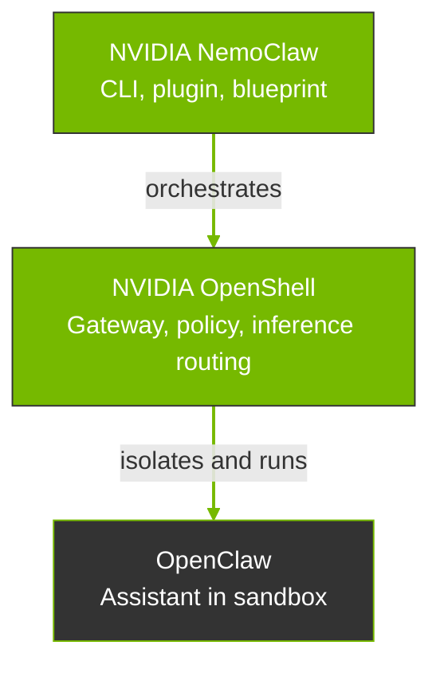

NemoClaw provides onboarding, lifecycle management, and OpenClaw operations within OpenShell containers.

This page describes how the ecosystem is formed across projects, where NemoClaw sits relative to [OpenShell](https://github.com/NVIDIA/OpenShell) and [OpenClaw](https://openclaw.ai), and how to choose between NemoClaw and OpenShell.

## How the Stack Fits Together

There are three pieces that are put together in a NemoClaw deployment: OpenClaw, OpenShell, and NemoClaw, each with a distinct scope.
The following diagram shows how they fit together.

NemoClaw sits above OpenShell in the operator workflow.
It drives OpenShell APIs and CLI to create and configure the sandbox that runs OpenClaw.
Models and endpoints sit behind OpenShell's inference routing.
NemoClaw onboarding wires provider choice into that routing.

| Project | Scope |
| --- | --- |
| [OpenClaw](https://openclaw.ai) | The assistant: runtime, tools, memory, and behavior inside the container. It does not define the sandbox or the host gateway. |
| [OpenShell](https://github.com/NVIDIA/OpenShell) | The execution environment: sandbox lifecycle, network, filesystem, and process policy, inference routing, and the operator-facing `openshell` CLI for those primitives. |
| NemoClaw | The NVIDIA reference stack that implements the definition above on the host: `nemoclaw` CLI and plugin, versioned blueprint, channel messaging configured for OpenShell-managed delivery, and state migration helpers so OpenClaw runs inside OpenShell in a documented, repeatable way. |

## NemoClaw Path versus OpenShell Path

Both paths assume OpenShell can sandbox a workload.
The difference is who owns the integration work.

| Path | What it means |
| --- | --- |
| **NemoClaw path** | You adopt the reference stack. NemoClaw's blueprint encodes a hardened image, default policies, and orchestration so `nemoclaw onboard` can stand up a known-good OpenClaw-on-OpenShell setup with less custom glue. |
| **OpenShell path** | You use OpenShell as the platform and supply your own container, install steps for OpenClaw, policy YAML, provider setup, and any host bridges. OpenShell stays the sandbox and policy engine; nothing requires NemoClaw's blueprint or CLI. |

## What NemoClaw Adds Beyond the OpenShell Community Sandbox

OpenShell ships a community sandbox for OpenClaw.
Running `openshell sandbox create --from openclaw` pulls that package, builds the image, applies the bundled policy, and starts a working sandbox.
This is a valid path, and it produces a running OpenClaw environment with OpenShell isolation.

NemoClaw builds on that foundation with additional security hardening, automation, and lifecycle tooling.

| Capability | `openshell sandbox create --from openclaw` | `nemoclaw onboard` |
| --- | --- | --- |
| Sandbox isolation | OpenShell applies seccomp filters, Landlock filesystem restrictions, privilege dropping, network namespace isolation, and no-new-privileges enforcement. | NemoClaw applies these through the blueprint and layers a more restrictive policy on top. |
| Credential handling | OpenShell's provider system replaces real credentials with placeholder tokens in the sandbox environment. You create providers manually with `openshell provider create`. | NemoClaw creates OpenShell providers automatically during onboarding and filters sensitive host environment variables from sandbox creation. |
| Image hardening | The community image includes standard system tools for general-purpose use. | NemoClaw strips build toolchains and network probes from the runtime image to reduce attack surface. |
| Inference setup | The community sandbox includes an `openclaw-start` script and supports manual provider setup from the host. | NemoClaw validates credentials from the host, lets you select a provider, and configures OpenShell inference routing automatically. |
| Channel messaging | OpenShell provides the credential provider system and L7 proxy that delivers channel tokens securely. | NemoClaw automates channel setup during onboarding and bakes OpenClaw channel config with placeholder tokens. |
| Blueprint versioning | No blueprint. The community sandbox uses whatever image version is currently published. | NemoClaw downloads the blueprint artifact, checks version compatibility, and verifies its digest before applying. |
| State migration | Not included. | NemoClaw migrates agent state across machines with credential stripping and integrity verification. |
| Process count limits | OpenShell applies seccomp and privilege dropping. | NemoClaw applies `ulimit -u 512` in the container entrypoint to cap the process count. |

## When to Use Which

Use the following table to decide when to use NemoClaw versus OpenShell.

| Situation | Prefer |
| --- | --- |
| You want OpenClaw with minimal assembly, NVIDIA defaults, and the documented install and onboard flow. | NemoClaw |
| You need maximum flexibility for custom images, a layout that does not match the NemoClaw blueprint, or a workload outside this reference stack. | OpenShell with your own integration |
| You are standardizing on the NVIDIA reference for always-on assistants with policy and inference routing. | NemoClaw |
| You are building internal platform abstractions where the NemoClaw CLI or blueprint is not the right fit. | OpenShell and your orchestration |

## Related Topics

- [Overview](/about/overview) contains what NemoClaw is, capabilities, benefits, and use cases.
- [How It Works](/about/how-it-works) describes NemoClaw's plugin, blueprint, sandbox creation, routing, and protection layers.
