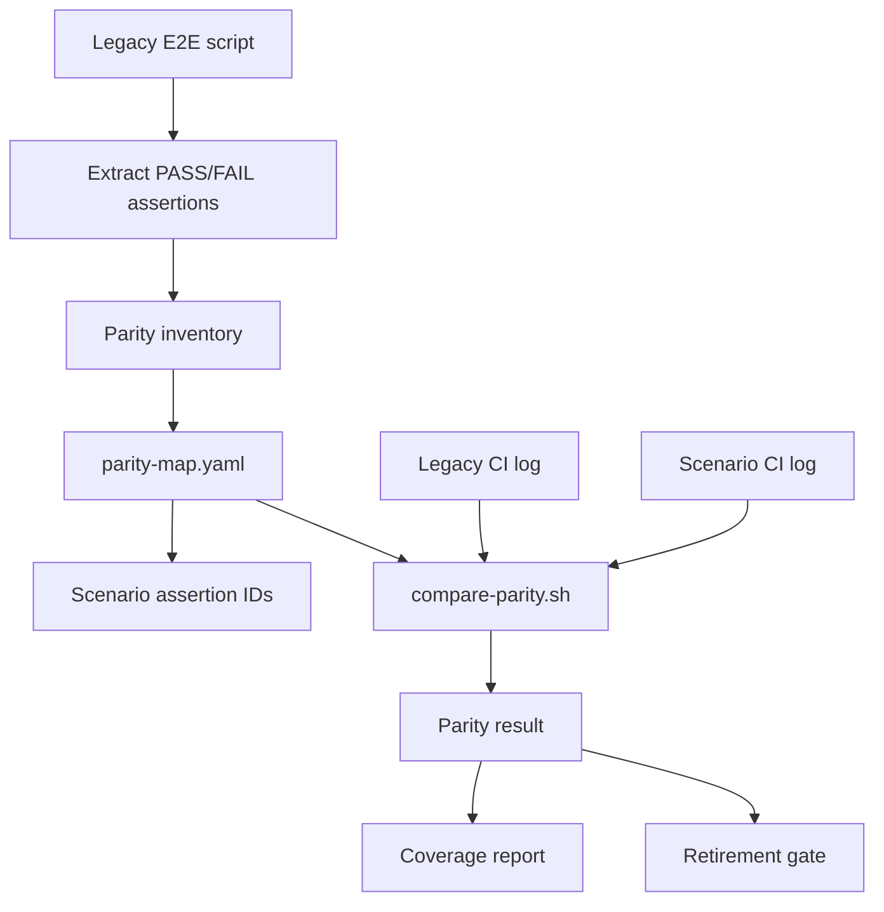
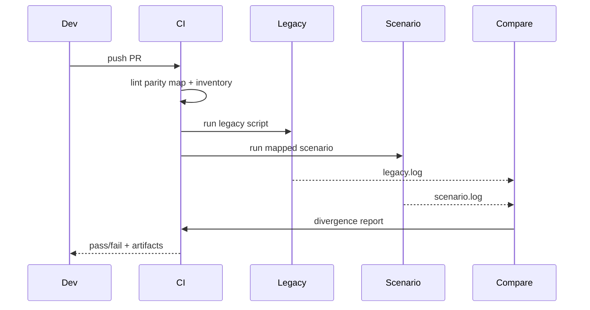

# Specification: E2E Full Coverage Parity

## Overview & Objectives

The scenario-based E2E foundation now gives NemoClaw a declarative setup matrix, reusable expected-state validation, suite execution, coverage reporting, and a parity comparison harness. It does **not** yet prove full coverage parity with the existing E2E suite. The next feature is to build on that foundation until every existing legacy E2E entrypoint is either represented by scenario-based coverage with assertion-level parity evidence or explicitly documented as deferred with a concrete infrastructure requirement.

Current parity gap summary:

- Legacy E2E entrypoints: all shell scripts matching `test/e2e/test-*.sh` (currently 45), plus `test/e2e/brev-e2e.test.ts`.
- Legacy shell LOC: generated from the current tree during inventory/reporting instead of hard-coded in tests.
- Scenario framework setup scenarios: 7.
- `test/e2e/docs/parity-map.yaml` entries: one seeded entry per discovered legacy shell script (currently 45).
- Mapped parity assertions: 0.

The feature goal is not to create a parallel test system. It is to migrate existing E2E behavior into the current scenario framework and make parity measurable, enforceable, and visible in CI.

### Objectives

1. Define a precise, auditable parity contract for legacy E2E coverage.
2. Inventory every legacy E2E assertion and map it to scenario-side assertions or an explicit deferred reason.
3. Migrate legacy behavior into scenario setup profiles, expected states, fixtures, and reusable validation suites.
4. Extend parity tooling so missing mappings and assertion divergences fail locally and in CI.
5. Upgrade coverage reporting to answer: “Do we have full parity with the existing E2E suite?”
6. Run side-by-side legacy-vs-scenario comparisons until non-deferred coverage has zero divergence.
7. Retire or wrap legacy scripts only after parity evidence exists.

Non-goals:

- Do not remove existing nightly E2E workflows before parity is proven.
- Do not rewrite the scenario framework from scratch.
- Do not treat setup-scenario coverage as equivalent to assertion-level parity.
- Do not add broad abstractions before a concrete migrated legacy script requires them.

## Current State Analysis

### Existing Scenario Framework

The current branch includes the foundation files:

```text
test/e2e/
  docs/
    README.md
    MIGRATION.md
    parity-map.yaml
  runtime/
    run-scenario.sh
    run-suites.sh
    coverage-report.sh
    resolver/
    lib/
  nemoclaw_scenarios/
    scenarios.yaml
    expected-states.yaml
    install/
    onboard/
    fixtures/
  validation_suites/
    suites.yaml
    smoke/
    inference/
    hermes/
    platform/
    assert/
```

Current scenario metadata covers these setup scenarios:

- `ubuntu-repo-cloud-openclaw`
- `ubuntu-repo-cloud-hermes`
- `gpu-repo-local-ollama-openclaw`
- `macos-repo-cloud-openclaw`
- `wsl-repo-cloud-openclaw`
- `brev-launchable-cloud-openclaw`
- `ubuntu-no-docker-preflight-negative`

The current `coverage-report.sh` reports setup scenario rows and metadata gaps. It does not report legacy script parity, assertion mapping completeness, side-by-side run status, or retirement readiness.

### Existing Parity Harness

`test/e2e/docs/parity-map.yaml` defines the intended mapping shape:

```yaml
scripts:
  test-full-e2e.sh:
    scenario: <migrated-scenario-id>
    assertions:
      - legacy: "<exact pass/fail string from legacy script>"
        id: <scenario.side.assertion.id>
        flaky: true
```

`scripts/e2e/compare-parity.sh` compares a legacy log to a scenario log using this map. It currently treats scripts with no mappings as “no-divergence,” which is useful during bootstrap but insufficient for a full parity gate.

`.github/workflows/e2e-parity-compare.yaml` can run a legacy script and a migrated scenario side by side for a selected input, then invoke `compare-parity.sh`. It needs matrix/status expansion for full-suite tracking.

### Legacy E2E Coverage Buckets

Legacy scripts should be migrated in waves that align with current duplication and infrastructure boundaries:

1. Onboarding baseline: full E2E, cloud onboarding, cloud inference.
2. Onboarding lifecycle: double onboard, GPU double onboard, repair, resume.
3. Sandbox lifecycle: operations, survival, snapshots, diagnostics, crash-loop recovery.
4. Rebuild and upgrade: OpenClaw rebuild, Hermes rebuild, stale upgrade, sandbox rebuild, gateway upgrade.
5. Inference variants: GPU, Ollama auth proxy, routing, Kimi compatibility, Hermes/OpenClaw inference switch.
6. Hermes: base Hermes, Slack, Discord.
7. Messaging: providers, token rotation, Telegram injection, compatible endpoint.
8. Security and policy: shields, network policy, credential sanitization, credential migration.
9. Runtime and platform services: runtime overrides, overlayfs autofix, device auth, deployment services.
10. Platform and remote: Spark, launchable smoke, Brev remote.
11. Miscellaneous: Brave search, remote dashboard bind, honest gateway health, skill agent, docs validation.

### Key Gaps

1. No generated inventory of legacy `PASS:` / `FAIL:` assertions.
2. Parity map entries are placeholders with empty scenarios and no assertion mappings.
3. The parity comparator does not fail on missing mappings in strict mode.
4. Coverage reporting does not include legacy parity status.
5. CI does not run the full side-by-side parity matrix.
6. Scenario suites do not yet cover most legacy assertions.
7. Deferred live-infrastructure cases are not represented as first-class parity status.
8. There is no safe retirement gate for old scripts and workflows.

## Architecture Design

### Parity Model

Parity is tracked at assertion level, not just script or scenario level.



Each legacy assertion must have one of these statuses:

- `mapped`: maps to a scenario-side assertion ID.
- `deferred`: requires unavailable live infrastructure or secrets, with owner and runner requirement.
- `retired`: intentionally obsolete behavior, with rationale and reviewer approval.

Each legacy script must have one of these statuses:

- `not-started`: seeded bootstrap entry; may have `scenario: ""` and `assertions: []` only in non-strict mode.
- `migrated`: scenario-side coverage exists, but zero-divergence evidence may still be pending.
- `parity-verified`: mapped assertions have recorded zero-divergence evidence.
- `deferred`: the whole entrypoint requires unavailable infrastructure, with owner and requirement metadata.
- `retired`: legacy entrypoint has been replaced by a thin scenario-runner wrapper after readiness checks pass.

Uncategorized assertions are not allowed once strict parity mode is enabled.

### Parity Map Schema Extension

Extend `test/e2e/docs/parity-map.yaml` without introducing a second source of truth:

```yaml
scripts:
  test-full-e2e.sh:
    scenario: ubuntu-repo-cloud-openclaw
    status: migrated
    owner: e2e
    assertions:
      - legacy: "CLI installation verified"
        id: smoke.cli.available
        status: mapped
      - legacy: "Cloud inference completed"
        id: inference.cloud.chat-completion
        status: mapped
      - legacy: "Some GPU-only assertion"
        status: deferred
        reason: requires-gpu-runner
        owner: e2e
```

Rules:

- `status` defaults to `not-started` only for existing bootstrap entries that have no assertion mappings yet.
- `scenario` is required for `status: migrated` and `status: parity-verified`.
- Each assertion must have exactly one status.
- `mapped` assertions require both `legacy` and `id`.
- `deferred` assertions require `legacy`, `reason`, `owner`, and either `runner_requirement` or `secret_requirement`.
- `retired` assertions require `legacy`, `reason`, `reviewer`, and `approved_at` before wrapper conversion.
- Empty `assertions: []` is allowed only for `status: not-started` during early phases.

### Assertion Inventory

Add a generated inventory artifact used for review and drift detection:

```text
test/e2e/docs/parity-inventory.generated.json
```

The inventory records:

- script path,
- assertion string,
- pass/fail polarity,
- source line,
- normalized ID suggestion,
- current mapping status from `parity-map.yaml`.

The file is generated deterministically by a script and committed so reviewers can see coverage movement in diffs.

### Scenario Assertion IDs

Scenario-side validation steps must emit stable assertion IDs through existing logging helpers. IDs should follow a predictable hierarchy:

```text
<domain>.<area>.<behavior>
```

Examples:

- `smoke.cli.available`
- `smoke.gateway.healthy`
- `inference.cloud.models-health`
- `sandbox.snapshot.create`
- `security.credentials.redacted`
- `messaging.telegram.injection-blocked`

The same ID must appear in scenario logs as `PASS:` or `FAIL:` so `compare-parity.sh` can compare outcomes.

### CI Gate Flow



## Configuration & Deployment Changes

### New or Updated Scripts

- Add `scripts/e2e/extract-legacy-assertions.ts` to generate the assertion inventory.
- Add `scripts/e2e/check-parity-map.ts` to validate schema and mapping completeness.
- Update `scripts/e2e/compare-parity.sh` with `--strict` mode.
- Update `test/e2e/runtime/coverage-report.sh` and `test/e2e/runtime/resolver/coverage.ts` to include parity status.

### Workflow Changes

- Extend `.github/workflows/e2e-parity-compare.yaml` to support parity batches/matrices.
- Extend `.github/workflows/e2e-scenarios.yaml` to upload parity-aware coverage reports.
- Do not disable existing nightly E2E workflows until the corresponding legacy scripts are `parity-verified` with a recorded zero-divergence run.

### Dependencies

Use existing Node/TypeScript tooling and `js-yaml`. Do not introduce another YAML library.

### Documentation

Update:

- `test/e2e/docs/MIGRATION.md`
- `test/e2e/docs/README.md`
- `AGENTS.md` only if developer workflow guidance changes.

## Implementation Phases

## Phase 1: Inventory Legacy Assertions

Create the auditable source of truth for legacy E2E assertions.

### Implementation Tasks

1. Add `scripts/e2e/extract-legacy-assertions.ts`.
2. Parse all `test/e2e/test-*.sh` scripts and `test/e2e/brev-e2e.test.ts` where applicable, deriving the entrypoint list from the filesystem so new legacy scripts are picked up automatically.
3. Extract stable `pass "..."`, `fail "..."`, `PASS:`, and `FAIL:` assertion strings.
4. Record script, line number, assertion text, polarity, and normalized ID suggestion.
5. Generate `test/e2e/docs/parity-inventory.generated.json` deterministically.
6. Add tests for common assertion extraction patterns.
7. Document how to regenerate the inventory.

### Acceptance Criteria

- Inventory includes every legacy shell script and the Brev E2E entrypoint.
- Inventory generation is deterministic.
- Scripts with zero extracted assertions are listed explicitly with a reason or review TODO.
- Unit tests cover quoted assertions, helper-wrapped assertions, and direct `PASS:` / `FAIL:` output.

## Phase 2: Enforce Parity Map Schema

Make `parity-map.yaml` structurally reliable before mapping work begins.

### Implementation Tasks

1. Add `scripts/e2e/check-parity-map.ts`.
2. Validate `parity-map.yaml` against the inventory.
3. Require every legacy script to have a parity-map entry.
4. Validate assertion statuses: `mapped`, `deferred`, `retired`.
5. Validate required fields for each status.
6. Keep permissive bootstrap mode for not-yet-started scripts.
7. Add strict mode that fails on empty mappings, uncategorized assertions, and unknown assertion strings.
8. Wire non-strict validation into existing E2E convention lint instead of adding a parallel lint path.

### Acceptance Criteria

- `npm test -- --project e2e-scenario-framework` validates the parity map in non-strict mode.
- `npx tsx scripts/e2e/check-parity-map.ts --strict` fails until all assertions are mapped/deferred/retired.
- Typos in legacy assertion strings are caught by comparing against the generated inventory.
- Duplicate scenario assertion IDs within a script are rejected unless explicitly marked reusable.

## Phase 3: Upgrade Parity Comparison and Reporting

Make parity status visible and enforceable.

### Implementation Tasks

1. Add `--strict` to `scripts/e2e/compare-parity.sh`.
2. In strict mode, fail when a script has no mappings or mapped assertions are missing in either log.
3. Emit a structured JSON report for every comparison, including pass, fail, missing, deferred, and retired counts.
4. Extend `test/e2e/runtime/resolver/coverage.ts` to include a legacy parity section.
5. Update `test/e2e/runtime/coverage-report.sh` to print parity summary and gaps.
6. Add tests for strict no-mapping failure, deferred assertions, retired assertions, and missing-log assertions.

### Acceptance Criteria

- Coverage report shows total legacy scripts, total legacy assertions, mapped assertions, deferred assertions, retired assertions, and unmapped assertions.
- Strict compare fails on missing mappings.
- Non-strict compare remains usable during incremental migration.
- CI artifacts include machine-readable parity reports.

## Phase 4: Migrate Onboarding Baseline Assertions

Prove assertion-level migration on the core OpenClaw cloud path.

### Implementation Tasks

1. Migrate assertions from:
   - `test-full-e2e.sh`
   - `test-cloud-onboard-e2e.sh`
   - `test-cloud-inference-e2e.sh`
2. Reuse `ubuntu-repo-cloud-openclaw` where possible.
3. Add or extend suites for CLI install, gateway health, sandbox list/status, cloud inference, credential presence, and sandbox inference route.
4. Emit stable scenario assertion IDs through logging helpers.
5. Populate parity-map assertions for these scripts.
6. Run side-by-side parity comparison locally where possible and in CI for live paths.

### Acceptance Criteria

- All non-deferred assertions in the three onboarding baseline scripts are mapped.
- Side-by-side parity produces zero divergence for mapped assertions.
- Coverage report marks the onboarding baseline bucket as migrated or parity-verified.
- Existing legacy scripts and workflows still run unchanged.

## Phase 5: Migrate Onboarding Lifecycle and Sandbox Lifecycle

Cover repeated onboarding and sandbox management behaviors.

### Implementation Tasks

1. Migrate assertions from:
   - `test-double-onboard.sh`
   - `test-gpu-double-onboard.sh`
   - `test-onboard-repair.sh`
   - `test-onboard-resume.sh`
   - `test-sandbox-operations.sh`
   - `test-sandbox-survival.sh`
   - `test-snapshot-commands.sh`
   - `test-diagnostics.sh`
   - `test-issue-2478-crash-loop-recovery.sh`
2. Add scenario profiles or suites only when needed by these scripts.
3. Share sandbox operation helpers instead of duplicating shell fragments.
4. Add expected-state validators for diagnostics, snapshot state, and crash-loop recovery as concrete consumers require them.
5. Populate parity-map entries and run comparisons.

### Acceptance Criteria

- All non-deferred assertions in this wave are mapped.
- Sandbox lifecycle suites use normalized `.e2e/context.env`.
- Scenario failures distinguish setup, expected-state validation, and suite failure.
- Parity report shows zero divergence for this wave.

## Phase 6: Migrate Rebuild, Upgrade, and Runtime Services

Cover lifecycle operations that mutate installed or running sandboxes.

### Implementation Tasks

1. Migrate assertions from:
   - `test-rebuild-openclaw.sh`
   - `test-rebuild-hermes.sh`
   - `test-upgrade-stale-sandbox.sh`
   - `test-sandbox-rebuild.sh`
   - `test-openshell-gateway-upgrade.sh`
   - `test-runtime-overrides.sh`
   - `test-overlayfs-autofix.sh`
   - `test-device-auth-health.sh`
   - `test-deployment-services.sh`
2. Add reusable fixtures for older base images, stale installs, runtime overrides, and Docker/overlayfs probes.
3. Extend expected states only for behavior checked before suites.
4. Keep mutation-heavy behavior inside suites so setup remains reusable.
5. Populate parity mappings and compare.

### Acceptance Criteria

- Rebuild and upgrade paths have scenario-side equivalents.
- Runtime/service assertions are mapped or deferred with explicit infrastructure requirements.
- No old workflow is retired yet unless parity has passed for the corresponding script.

## Phase 7: Migrate Inference, Hermes, and Messaging Variants

Cover provider, agent, and messaging matrix behavior.

### Implementation Tasks

1. Migrate assertions from:
   - `test-gpu-e2e.sh`
   - `test-ollama-auth-proxy-e2e.sh`
   - `test-inference-routing.sh`
   - `test-kimi-inference-compat.sh`
   - `test-hermes-e2e.sh`
   - `test-hermes-slack-e2e.sh`
   - `test-hermes-discord-e2e.sh`
   - `test-hermes-inference-switch.sh`
   - `test-openclaw-inference-switch.sh`
   - `test-messaging-providers.sh`
   - `test-token-rotation.sh`
   - `test-telegram-injection.sh`
   - `test-messaging-compatible-endpoint.sh`
2. Add or extend fake endpoint fixtures for deterministic fast-mode parity.
3. Add suites for provider routing, auth proxy, Kimi compatibility, Hermes health, Slack/Discord/Telegram messaging, token rotation, and injection resistance.
4. Mark GPU and live messaging assertions deferred only when no deterministic fake or runner is available.
5. Populate parity mappings and compare.

### Acceptance Criteria

- Provider and messaging assertions are mapped to stable scenario assertion IDs.
- Fake endpoint tests cover deterministic behavior without real external services where possible.
- Live-service-only assertions are explicitly deferred with owner and required secret/runner.
- Parity report shows zero divergence for non-deferred assertions.

## Phase 8: Migrate Security, Policy, Platform, and Miscellaneous Coverage

Finish the remaining legacy buckets.

### Implementation Tasks

1. Migrate assertions from:
   - `test-shields-config.sh`
   - `test-network-policy.sh`
   - `test-credential-sanitization.sh`
   - `test-credential-migration.sh`
   - `test-spark-install.sh`
   - `test-launchable-smoke.sh`
   - `brev-e2e.test.ts`
   - `test-brave-search-e2e.sh`
   - `test-dashboard-remote-bind.sh`
   - `test-gateway-health-honest.sh`
   - `test-skill-agent-e2e.sh`
   - `test-docs-validation.sh`
2. Add suites for security policy, credential hygiene, Spark install, Launchable/Brev remote, Brave search, remote dashboard bind, honest gateway health, skill agent, and docs validation.
3. Extend scenario metadata for DGX Spark or remote runners only when required.
4. Populate parity mappings and compare.

### Acceptance Criteria

- Every legacy entrypoint is either mapped, deferred, or retired.
- Strict parity map validation has no uncategorized assertions.
- Platform-specific scenarios have explicit runner requirements.

## Phase 9: Expand CI Parity Gates

Run parity checks as a first-class CI signal.

### Implementation Tasks

1. Extend `.github/workflows/e2e-parity-compare.yaml` to support batch or matrix execution over migrated scripts.
2. Add inputs for bucket, script, scenario, strict mode, and deferred handling.
3. Upload legacy logs, scenario logs, parsed assertion reports, and coverage reports.
4. Add a scheduled or label-triggered parity job for migrated buckets.
5. Keep full parity as required for retirement, but not necessarily for every normal PR until runtime cost is acceptable.
6. Document how maintainers trigger parity for one script or one bucket.

### Acceptance Criteria

- Maintainers can run parity for a single script, a bucket, or all migrated buckets.
- CI fails on divergence in strict mode.
- Deferred assertions are visible in summaries and artifacts.
- The PR page clearly shows whether parity passed for migrated buckets.

## Phase 10: Enforce Retirement Readiness

Prevent accidental removal of legacy coverage.

### Implementation Tasks

1. Add a retirement readiness check to `check-parity-map.ts`.
2. A script can be retired only when:
   - every assertion is mapped, deferred, or retired,
   - all mapped assertions have at least one zero-divergence parity run,
   - deferred assertions have documented runner/secret requirements,
   - no active workflow references the old script.
3. Record zero-divergence evidence in `parity-map.yaml` under each `parity-verified` script using deterministic fields: `run_id`, `workflow`, `commit`, and `completed_at`; local/manual evidence may use `workflow: local` and a reviewer-approved `run_id`.
4. Update `test/e2e/docs/MIGRATION.md` with retirement status per script.
5. Add workflow/docs reference scanning.

### Acceptance Criteria

- Retirement check blocks removal of unverified scripts.
- `MIGRATION.md` shows not-started, migrated, parity-verified, deferred, and retired states.
- Workflow references to removed scripts are caught in tests.

## Phase 11: Clean the House

Remove duplication only after parity evidence exists.

### Implementation Tasks

1. Replace parity-verified legacy scripts with thin wrappers around the scenario runner.
2. Update workflows to call scenario runner for retired paths.
3. Remove dead helper duplication made obsolete by scenario helpers.
4. Update `test/e2e/docs/README.md` and `test/e2e/docs/MIGRATION.md`.
5. Update `README.md`, `AGENTS.md`, or contributor guidance if E2E invocation changes.
6. Resolve TODOs introduced during migration.
7. Keep rollback notes for any retired legacy path.

### Acceptance Criteria

- No unverified legacy coverage is removed.
- Current and future E2E entrypoints are clear.
- Documentation explains how to add a new scenario, suite, assertion ID, and parity mapping.
- Full parity report has no unmapped assertions.

## Final Validation Summary

At the end of this specification, validation should prove:

1. The legacy assertion inventory is complete and deterministic.
2. Every legacy E2E assertion is mapped, deferred, or retired.
3. Strict parity-map validation passes.
4. Scenario-side suites emit stable assertion IDs.
5. Side-by-side parity runs have zero divergence for all non-deferred assertions.
6. Coverage reporting clearly shows setup coverage and legacy assertion parity.
7. CI can run parity for one script, one bucket, or all migrated buckets.
8. Legacy scripts are retired or wrapped only after evidence-based readiness checks pass.

## Risks and Mitigations

| Risk | Mitigation |
|---|---|
| Assertion extraction misses helper-wrapped cases | Start with generated inventory plus reviewer-visible source lines; add tests for each missed pattern. |
| Parity map becomes too large to review | Migrate by buckets; keep deterministic ordering; report summarized counts in coverage output. |
| Live infrastructure makes parity flaky | Use fake endpoints and dry-run where equivalent; mark true infra dependencies as deferred with owner and runner requirements. |
| Scenario suite duplicates old monolithic scripts | Require shared helpers and context consumption; reject suites that redo setup/onboarding. |
| Strict gates block normal development too early | Keep non-strict mode for bootstrap; enable strict per migrated bucket before global strict mode. |
| Retiring legacy scripts loses coverage | Require zero-divergence parity evidence and workflow reference scanning before retirement. |
| CI cost grows too high | Support single-script, bucket, and scheduled modes; reserve full parity for release/label-triggered runs. |
