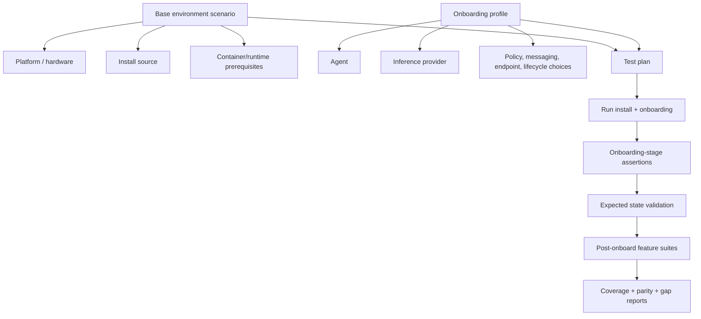
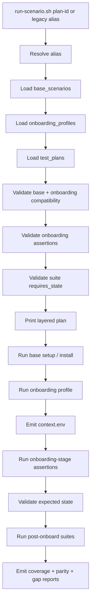

# Specification: New E2E Model

## Overview & Objectives

NemoClaw's scenario-based E2E migration has reached the point where live execution is exposing real setup, onboarding, and feature-validation failures. The current framework is directionally correct, but it still treats a "scenario" as a single combined unit: platform + install + runtime + onboarding choices + expected state + post-onboard suites. That makes the matrix hard to expand, hard to report, and hard to use for coverage-gap discovery.

This specification restructures the E2E model into explicit layers:

```text
base environment setup
  → onboarding decision matrix with step assertions
    → expected-state validation
      → post-onboard feature suites
        → parity / coverage reporting
```



### Objectives

1. Separate fundamental environment differences from onboarding decisions.
2. Make install/platform/runtime coverage visible independently from onboarding coverage.
3. Add first-class onboarding-stage assertions instead of only post-onboard checks.
4. Preserve the current scenario runner behavior while evolving the schema in-place.
5. Turn the existing parity map into an actionable gap-reporting source.
6. Make it clear whether an E2E failure happened in base setup, onboarding, expected-state validation, or post-onboard feature validation.
7. Expand coverage without creating one-off shell scripts or duplicating setup logic.
8. Improve GitHub Actions visibility for parity and coverage reports.

## Current State Analysis

Current scenario documentation describes this flow:

```text
setup scenario → expected state → suite sequence
```

The current YAML files are:

- `test/e2e/nemoclaw_scenarios/scenarios.yaml`
- `test/e2e/nemoclaw_scenarios/expected-states.yaml`
- `test/e2e/validation_suites/suites.yaml`
- `test/e2e/docs/parity-map.yaml`

Current `setup_scenarios` combine these dimensions:

- platform: `ubuntu-local`, `macos-local`, `wsl-local`, `gpu-runner`, `brev-launchable`, `dgx-spark`
- install: `repo-current`, `public-curl`, `launchable`, `release`, `upgrade-from-version`
- runtime: `docker-running`, `gpu-docker-cdi`, `docker-missing`
- onboarding: `cloud-openclaw`, `cloud-hermes`, `local-ollama-openclaw`, `openai-compatible-openclaw`

Current scenario IDs include:

- `ubuntu-repo-cloud-openclaw`
- `ubuntu-repo-cloud-hermes`
- `gpu-repo-local-ollama-openclaw`
- `macos-repo-cloud-openclaw`
- `wsl-repo-cloud-openclaw`
- `brev-launchable-cloud-openclaw`
- `ubuntu-no-docker-preflight-negative`

The current model already has useful structure, but there are several gaps:

1. **Scenario IDs hide layer boundaries.** `ubuntu-repo-cloud-openclaw` includes base setup and onboarding in one name.
2. **Base setup cannot be reported independently.** There is no direct answer to "which install methods run on which platforms before onboarding?"
3. **Onboarding choices are not matrixed cleanly.** Provider, agent, endpoint, messaging, policy, and lifecycle variants are embedded in profiles or deferred to future scenarios.
4. **Onboarding assertions are under-modeled.** The runner validates final state and then suites run, but there is no explicit onboarding-stage assertion group for prompts, provider config, credential placement, policy selection, or resume/repair/double-onboard behavior.
5. **Post-onboard suites are currently thin.** The present suite list covers smoke, cloud inference, credentials-present, local Ollama checks, Ollama proxy, platform smoke, and Hermes health.
6. **Parity gaps are large and not yet organized by layer.** Current parity-map status counts are approximately:

   ```text
   mapped:   165
   deferred: 1642
   retired:  125
   ```

7. **Deferred parity assertions are visible but not yet actionable enough.** They need to be classified as base setup, onboarding flow, expected state, post-onboard suite, negative/failure mode, or retire.
8. **GitHub visibility is incomplete.** Parity compare uploads JSON and logs as artifacts, but does not currently publish a concise report to `$GITHUB_STEP_SUMMARY`.

### High-value deferred areas

The largest deferred areas in `test/e2e/docs/parity-map.yaml` currently include:

| Legacy area | Deferred assertions | Likely layer |
|---|---:|---|
| `test-messaging-providers.sh` | 108 | onboarding + post-onboard messaging |
| `test-double-onboard.sh` | 81 | onboarding lifecycle |
| `test-shields-config.sh` | 78 | onboarding security + post-onboard security |
| `test-sandbox-survival.sh` | 71 | post-onboard lifecycle |
| `test-gpu-e2e.sh` | 60 | base GPU + local inference |
| `test-ollama-auth-proxy-e2e.sh` | 59 | onboarding/provider + post-onboard proxy |
| `test-token-rotation.sh` | 55 | onboarding lifecycle + messaging |
| `test-gpu-double-onboard.sh` | 54 | base GPU + onboarding lifecycle |
| `test-credential-sanitization.sh` | 50 | onboarding security + post-onboard security |
| `test-inference-routing.sh` | 49 | onboarding/provider + post-onboard inference |
| `test-hermes-e2e.sh` | 48 | onboarding + Hermes feature checks |
| `test-onboard-resume.sh` | 48 | onboarding lifecycle |
| `test-onboard-repair.sh` | 46 | onboarding lifecycle |

These counts are not a one-to-one list of tests to write. They are extracted legacy assertions that must be mapped, consolidated, implemented, gated, or retired.

## Related Issues and Scope Boundaries

This specification is the concrete implementation plan for #3588, under the broader E2E restructuring epic #3281. It should create the layered scenario model and plan-resolution foundation without absorbing every follow-on stabilization issue.

Schema-shaping hooks included here:

- #3604 capability-aware scenario planning: base scenarios and test plans may declare runner requirements or capability metadata so future capability checks do not require another schema migration. This specification does not implement runtime capability detection, suite scaling, or runner introspection.
- #3608 expected-failure scenarios: negative plans may declare expected-failure metadata so no-Docker and similar cases are represented structurally. This specification does not implement the full expected-vs-actual failure matcher or cleanup-invariant runner.

Follow-up issues intentionally kept separate:

- #3589 publish parity and coverage reports to workflow summaries.
- #3605 introduce a unified route resolver for gateway and inference checks.
- #3606 make repo install hermetic and observable.
- #3607 standardize phase diagnostics and failure envelopes.
- #3609 define GPU sandbox policy and diagnostics contracts.
- #3610 extract platform execution adapters for WSL, macOS, and GPU.

The layered model should use names and metadata compatible with those follow-up issues, but Phase 1 must remain limited to docs, schema, resolver behavior, aliases, and plan-only compatibility.

## Architecture Design

### Conceptual entities

#### 1. Base environment scenarios

A base environment scenario describes what exists before onboarding decisions are applied.

```yaml
base_scenarios:
  ubuntu-repo-docker:
    platform: ubuntu-local
    install: repo-current
    runtime: docker-running

  gpu-repo-docker-cdi:
    platform: gpu-runner
    install: repo-current
    runtime: gpu-docker-cdi
    runner_requirements:
      - self-hosted-gpu
      - docker-cdi

  brev-launchable-remote:
    platform: brev-launchable
    install: launchable
    runtime: docker-running
    runner_requirements:
      - ubuntu-latest
      - brev-api-token
      - launchable-image

  ubuntu-repo-no-docker:
    platform: ubuntu-local
    install: repo-current
    runtime: docker-missing
    expected_failure:
      phase: preflight
      error_class: docker-missing
      forbidden_side_effects:
        - gateway-started
        - sandbox-created
```

Capability-related fields such as `runner_requirements` are metadata in Phase 1. They should be preserved in resolved plans, but live runner capability detection is deferred to #3604.

Expected-failure fields are also metadata in Phase 1. They make negative scenarios structurally visible, but the full matcher that compares actual failure phase/reason/side effects is deferred to #3608.

This layer answers:

- What platform/hardware is being used?
- What install path is being tested?
- What container runtime condition is expected?
- What runner/secrets are required?
- Is this a positive base or a negative preflight base?

Example base IDs:

```text
base-ubuntu-repo-docker
base-ubuntu-curl-docker
base-ubuntu-release-docker
base-ubuntu-upgrade-from-version-docker
base-macos-repo-docker
base-wsl-repo-docker
base-gpu-repo-docker-cdi
base-brev-launchable-remote
base-dgx-spark-repo-docker
base-ubuntu-repo-no-docker
```

This layer verifies:

- install succeeds
- CLI is available at the expected path and shell command hashing does not resolve a stale binary
- Docker/runtime preflight is correct for the selected runtime
- platform-specific assumptions are true, including WSL-in-Ubuntu execution, macOS Docker mode, GPU CDI availability, Brev remote reachability, and DGX Spark prerequisites when present
- negative preflight scenarios fail before sandbox creation and leave no gateway/sandbox ghost state

#### 2. Onboarding profiles

An onboarding profile describes user choices made during onboarding.

```yaml
onboarding_profiles:
  cloud-nvidia-openclaw:
    path: cloud
    provider: nvidia
    agent: openclaw
    inference_route: inference-local

  cloud-nvidia-hermes:
    path: cloud
    provider: nvidia
    agent: hermes
    inference_route: inference-local

  local-ollama-openclaw:
    path: local
    provider: ollama
    agent: openclaw
    inference_route: inference-local

  openai-compatible-openclaw:
    path: cloud
    provider: openai-compatible
    agent: openclaw
    inference_route: inference-local

  cloud-nvidia-openclaw-with-brave:
    extends: cloud-nvidia-openclaw
    features:
      web_search: brave
    secrets:
      - BRAVE_API_KEY
```

This layer answers:

- Which agent is onboarded?
- Which provider is configured?
- Which endpoint/model route is selected?
- Which policy presets or tiers are selected?
- Which messaging provider is selected?
- Is this a lifecycle variant such as resume, repair, repeat, or token rotation?

Example onboarding IDs:

```text
onboard-cloud-nvidia-openclaw
onboard-cloud-nvidia-hermes
onboard-local-ollama-openclaw
onboard-openai-compatible-openclaw
onboard-cloud-nvidia-openclaw-brave
onboard-cloud-nvidia-openclaw-telegram
onboard-cloud-nvidia-openclaw-discord
onboard-cloud-nvidia-openclaw-slack
onboard-cloud-nvidia-hermes-discord
onboard-cloud-nvidia-hermes-slack
onboard-cloud-nvidia-openclaw-resume-after-interrupt
onboard-cloud-nvidia-openclaw-repair-existing-config
onboard-cloud-nvidia-openclaw-double-same-provider
onboard-cloud-nvidia-openclaw-double-provider-switch
```

This layer verifies onboarding decisions and transitions, including:

- non-interactive prompt handling and third-party acceptance behavior
- provider/model/endpoint written correctly
- gateway state created
- sandbox state created
- credentials stored in gateway-managed location
- no raw secrets in sandbox config or sandbox-visible environment
- policy presets/tiers applied
- messaging/web-search selections wired through to gateway policy and agent config
- resume, repair, double-onboard, provider-switch, and token-rotation behavior

#### 3. Test plans

A test plan combines a base scenario, an onboarding profile, an expected state, onboarding assertions, and post-onboard suites.

```yaml
test_plans:
  ubuntu-repo-docker__cloud-nvidia-openclaw:
    base: ubuntu-repo-docker
    onboarding: cloud-nvidia-openclaw
    expected_state: cloud-openclaw-ready
    onboarding_assertions:
      - base-installed
      - preflight-passed
      - gateway-created
      - sandbox-created
      - provider-configured
      - credentials-gateway-managed
    suites:
      - smoke
      - cloud-inference
      - credentials
```

Existing scenario IDs can remain as aliases during migration:

```yaml
setup_scenarios:
  ubuntu-repo-cloud-openclaw:
    alias_for_plan: ubuntu-repo-docker__cloud-nvidia-openclaw
```

This avoids breaking current workflow dispatches while moving the source of truth to layered test plans.

#### 4. Onboarding-stage assertions

Onboarding assertions run after install/onboard operations and before post-onboard feature suites. They are distinct from post-onboard suites because they validate setup decisions and state transitions.

Initial assertion groups:

```yaml
onboarding_assertions:
  base-installed:
    stage: base
    script: onboarding_assertions/base/00-cli-installed.sh

  preflight-passed:
    stage: onboarding
    script: onboarding_assertions/preflight/00-preflight-passed.sh

  gateway-created:
    stage: onboarding
    script: onboarding_assertions/state/00-gateway-created.sh

  sandbox-created:
    stage: onboarding
    script: onboarding_assertions/state/01-sandbox-created.sh

  provider-configured:
    stage: onboarding
    script: onboarding_assertions/provider/00-provider-configured.sh

  credentials-gateway-managed:
    stage: onboarding
    script: onboarding_assertions/security/00-credentials-gateway-managed.sh

  no-secret-leak:
    stage: onboarding
    script: onboarding_assertions/security/01-no-secret-leak.sh

  policy-applied:
    stage: onboarding
    script: onboarding_assertions/security/02-policy-applied.sh
```

Each assertion emits stable markers:

```text
PASS: onboarding.provider.configured
FAIL: onboarding.provider.configured
```

These IDs are mapped from `parity-map.yaml` and included in gap reports.

#### 5. Post-onboard feature suites

Feature suites run after expected state validation and must not install or onboard.

Suite families should be organized by feature domain:

```text
validation_suites/
  smoke/
  gateway/
  sandbox/
  inference/
    cloud/
    local-ollama/
    openai-compatible/
    switch/
    routing/
    kimi/
  messaging/
    telegram/
    discord/
    slack/
    token-rotation/
  security/
    credentials/
    policy/
    shields/
    injection/
  lifecycle/
    double-onboard/
    resume/
    repair/
    survival/
    operations/
    rebuild/
    upgrade/
    snapshot/
    diagnostics/
    docs-validation/
  platform/
    macos/
    wsl/
    gpu/
    brev/
    spark/
```

Canonical suite IDs should include at least:

```text
suite.smoke
suite.gateway-health
suite.sandbox-shell
suite.cloud-inference
suite.local-ollama-inference
suite.ollama-auth-proxy
suite.openai-compatible-inference
suite.inference-routing
suite.inference-switch
suite.kimi-compatibility
suite.messaging.telegram
suite.messaging.discord
suite.messaging.slack
suite.messaging.token-rotation
suite.security.credentials
suite.security.policy
suite.security.shields
suite.security.injection
suite.sandbox.lifecycle
suite.sandbox.operations
suite.snapshot
suite.rebuild
suite.upgrade
suite.diagnostics
suite.docs-validation
```

Feature suites consume the context produced by base setup and onboarding. They must not install, onboard, mutate onboarding choices, or rediscover scenario state except through `$E2E_CONTEXT_DIR/context.env`.

Suites continue to declare `requires_state` and are selected by each test plan.

### Updated runner flow



### Compatibility rules

The resolver must fail fast with clear messages when:

- a test plan references a missing base scenario
- a test plan references a missing onboarding profile
- a test plan references a missing expected state
- a test plan references a missing onboarding assertion
- a test plan references a missing suite
- a suite `requires_state` key is incompatible with the selected expected state
- an onboarding profile declares `runner_requirements`, `required_secrets`, or capability metadata that are structurally incompatible with the selected base plan metadata
- a negative base scenario is combined with a positive onboarding profile without `expected_failure`

Phase 1 compatibility validation is metadata-only: preserve `runner_requirements`, `required_secrets`, capability metadata, and `expected_failure` metadata in plan output when present, and validate only declared incompatibilities. It must not probe live runner capabilities, check whether secrets exist in the environment, or perform structured failure matching.

### Gap classification model

Extend parity metadata so every deferred assertion has a layer classification:

```yaml
- legacy: "NemoClaw installed"
  status: mapped
  id: base.cli.installed
  layer: base-environment

- legacy: "sandbox shell env does not expose the real key"
  status: deferred
  layer: onboarding-flow
  gap_domain: credential-security
  owner: e2e-maintainers
  runner_requirement: sandbox runner with NemoClaw/OpenShell CLIs

- legacy: "agent web-search returned a real Brave result"
  status: deferred
  layer: post-onboard-suite
  gap_domain: brave-search
  secret_requirement: BRAVE_API_KEY
```

Allowed layers:

- `base-environment`
- `onboarding-flow`
- `expected-state`
- `post-onboard-suite`
- `negative-failure-mode`
- `retired`

Reports should aggregate by layer and gap domain.

### Reporting design

Generate reports in `.e2e/reports/`:

```text
.e2e/reports/
  plan.json
  base-report.json
  onboarding-report.json
  expected-state-report.json
  suite-report.json
  parity-report.json
  gap-report.json
  summary.md
```

The GitHub workflows should append `summary.md` to `$GITHUB_STEP_SUMMARY`.

Minimum visible summary:

```markdown
## E2E Layered Plan Summary

| Layer | Result | Notes |
|---|---|---|
| Base environment | PASS | ubuntu / repo-current / docker-running |
| Onboarding | PASS | cloud / nvidia / openclaw |
| Expected state | PASS | cloud-openclaw-ready |
| Suites | FAIL | cloud-inference: chat-completion |

## Parity Coverage

| Layer | Mapped | Deferred | Retired |
|---|---:|---:|---:|
| Base environment | 42 | 18 | 5 |
| Onboarding flow | 51 | 512 | 20 |
| Expected state | 19 | 30 | 2 |
| Post-onboard suite | 53 | 1002 | 91 |
| Negative/failure mode | 0 | 80 | 7 |
```

## Configuration & Deployment Changes

### Files to modify

- `test/e2e/nemoclaw_scenarios/scenarios.yaml`
  - Introduce `base_scenarios`, `onboarding_profiles`, and `test_plans`.
  - Preserve `runner_requirements` / capability metadata and `expected_failure` metadata in resolved plans when present.
  - Keep existing `platforms`, `installs`, and `runtimes` profiles.
  - Keep `setup_scenarios` as alias compatibility until final cleanup.

- `test/e2e/nemoclaw_scenarios/expected-states.yaml`
  - Add expected states as new onboarding and feature domains are migrated.
  - Keep expected states structural, not feature exhaustive.

- `test/e2e/validation_suites/suites.yaml`
  - Add suite families and layer-friendly suite IDs.
  - Preserve existing suite IDs until migrated.

- `test/e2e/runtime/resolver/schema.ts`
  - Validate new layered schema.

- `test/e2e/runtime/resolver/load.ts`
  - Load layered definitions and compatibility aliases.

- `test/e2e/runtime/resolver/plan.ts`
  - Resolve base + onboarding + plan into executable plan.

- `test/e2e/runtime/resolver/coverage.ts`
  - Add layer-aware coverage and gap aggregation.

- `test/e2e/runtime/resolver/index.ts`
  - Support plan resolution and reporting commands for layered plans.

- `test/e2e/runtime/run-scenario.sh`
  - Accept both legacy scenario IDs and new test plan IDs.
  - Run onboarding-stage assertions between onboarding and expected-state validation.

- `test/e2e/runtime/run-suites.sh`
  - Preserve suite execution; add report hooks if needed.

- `test/e2e/runtime/coverage-report.sh`
  - Render layer-aware coverage.

- `scripts/e2e/check-parity-map.ts`
  - Validate `layer` and `gap_domain` metadata for deferred assertions.

- `scripts/e2e/compare-parity.sh`
  - Include layer metadata in reports.

- `.github/workflows/e2e-scenarios.yaml`
  - Render report summary into `$GITHUB_STEP_SUMMARY`.

- `.github/workflows/e2e-parity-compare.yaml`
  - Render parity/gap summary into `$GITHUB_STEP_SUMMARY`.

- `test/e2e/docs/README.md`
  - Document the layered model.

- `test/e2e/docs/MIGRATION.md`
  - Track migration by layer and domain rather than only by legacy script.

### New files / directories

```text
test/e2e/onboarding_assertions/
  base/
  preflight/
  state/
  provider/
  security/
  lifecycle/

test/e2e/runtime/reports/
  render-summary.ts
  render-gap-report.ts
```

### Environment variables

No new required environment variables are introduced in Phase 1.

Capability detection, route resolution, hermetic install diagnostics, standardized failure envelopes, GPU diagnostics, and platform adapters are explicitly out of Phase 1 scope and remain tracked by their follow-up issues.

Existing env remains relevant:

- `E2E_CONTEXT_DIR`
- `E2E_SUITE_FILTER`
- `E2E_VALIDATE_EXPECTED_STATE`
- `NEMOCLAW_RECREATE_SANDBOX`
- `NVIDIA_API_KEY`

Future filter environment variables are intentionally out of scope until a concrete workflow needs them.

## Implementation Phases

## Phase 1: Layered Terminology and Schema Planning [COMPLETED: 57cd725]

Introduce the layered terminology and schema support while preserving current scenario IDs and behavior. This phase is intentionally documentation-first plus plan-only resolver work: future contributors should learn the new mental model before feature migration continues.

### Implementation

1. Update `test/e2e/docs/README.md` and `test/e2e/docs/MIGRATION.md` to define:
   - base environment = platform + install + runtime
   - onboarding profile = user choices during onboarding
   - feature suite = post-onboard behavior
2. Extend `scenarios.yaml` with:
   - `base_scenarios`
   - `onboarding_profiles`
   - `test_plans`
   - `setup_scenarios.<id>.alias_for_plan`
3. Add layered equivalents for all existing scenarios:
   - `ubuntu-repo-cloud-openclaw`
   - `ubuntu-repo-cloud-hermes`
   - `gpu-repo-local-ollama-openclaw`
   - `macos-repo-cloud-openclaw`
   - `wsl-repo-cloud-openclaw`
   - `brev-launchable-cloud-openclaw`
   - `ubuntu-no-docker-preflight-negative`
4. Update resolver schema to accept both old and new forms.
5. Update resolver plan output to include:
   - base ID
   - onboarding ID
   - expected state ID
   - onboarding assertion IDs
   - suite IDs
   - runner requirement / capability metadata when present
   - expected-failure metadata when present
6. Keep `run-scenario.sh <old-id>` working through aliases.

### Acceptance Criteria

- E2E docs explain base environments, onboarding profiles, test plans, onboarding assertions, expected states, and post-onboard feature suites.
- `bash test/e2e/runtime/run-scenario.sh ubuntu-repo-cloud-openclaw --plan-only` still succeeds.
- `bash test/e2e/runtime/run-scenario.sh ubuntu-repo-docker__cloud-nvidia-openclaw --plan-only` succeeds.
- Plan JSON contains separate `base`, `onboarding`, `expected_state`, and `suites` sections.
- Plan JSON preserves runner requirement / capability metadata and expected-failure metadata when present.
- Existing scenario-framework tests pass.
- No live E2E behavior changes are required in this phase.

## Phase 2: Layered Coverage and Gap Reports [COMPLETED: 71fddfdc9]

Make the existing coverage and parity data visible by layer.

### Implementation

1. Add layer metadata support to `parity-map.yaml` validation.
2. For existing mapped/deferred/retired assertions, initially infer layer from script bucket when explicit layer is absent.
3. Update `coverage-report.sh` / resolver coverage logic to render:
   - base scenario coverage
   - onboarding profile coverage
   - test plan coverage
   - suite coverage
   - parity status by layer
   - top deferred gap domains
4. Add `.e2e/reports/summary.md` generation for local artifacts and later workflow consumption.

### Acceptance Criteria

- `bash test/e2e/runtime/coverage-report.sh` includes sections for base scenarios, onboarding profiles, test plans, suites, and parity by layer.
- Parity map validation accepts explicit `layer` fields.
- Deferred assertions without explicit layer are still accepted with an inferred/default layer during transition.
- `.e2e/reports/summary.md` shows the layered coverage report for local runs and workflow artifacts.
- Artifacts still include JSON and raw logs.

## Phase 3: Onboarding Assertion Stage [COMPLETED: 9587add9d]

Add a first-class onboarding assertion stage between onboarding execution and expected-state validation.

### Implementation

1. Add `test/e2e/onboarding_assertions/` structure.
2. Add initial assertion scripts:
   - CLI installed / path stable
   - preflight passed or expected preflight failed
   - gateway created or absent
   - sandbox created or absent
   - provider configured
   - credentials gateway-managed
   - no obvious secret leak
   - policy preset/tier applied when declared
3. Add `onboarding_assertions` section to `scenarios.yaml`.
4. Update `run-scenario.sh` to execute selected onboarding assertions after onboarding and before expected-state validation.
5. Ensure each assertion emits stable `PASS:` / `FAIL:` IDs.
6. Map the most obvious legacy assertions from baseline onboarding scripts to these IDs.

### Acceptance Criteria

- Positive plans run onboarding assertions before expected-state validation.
- Negative preflight plan asserts no gateway/sandbox ghost state through onboarding assertion stage.
- Logs clearly show an `onboarding-assertions` stage.
- Assertion IDs are stable and appear in parity reports.
- At least baseline install/gateway/sandbox/provider/credential assertions are mapped from legacy parity entries.

## Phase 4: Onboarding Matrix Expansion [COMPLETED: af628e2e9]

Move onboarding lifecycle and provider variants into explicit onboarding profiles/test plans.

### Implementation

1. Add onboarding profiles for:
   - OpenAI-compatible OpenClaw
   - cloud NVIDIA OpenClaw with Brave
   - Telegram OpenClaw
   - Discord OpenClaw
   - Slack OpenClaw
   - Hermes Discord
   - Hermes Slack
   - resume after interrupt
   - repair existing onboarding
   - double onboard same provider
   - double onboard provider switch
   - token rotation
2. Add test plans for the smallest useful cross-product rather than full Cartesian explosion.
3. Add compatibility rules so unsupported base/onboarding combinations fail at plan time.
4. Migrate deferred assertions from onboarding-heavy legacy scripts into onboarding assertion IDs or suite IDs.

### Acceptance Criteria

- Onboarding lifecycle plans exist for double-onboard, repair, and resume.
- Messaging onboarding profiles exist for Telegram, Discord, and Slack.
- Provider profiles exist for NVIDIA cloud, local Ollama, and OpenAI-compatible endpoint.
- Coverage report shows onboarding profile coverage independently from base environment coverage.
- Deferred counts decrease for onboarding lifecycle scripts.

## Phase 5: Post-Onboard Suite Reorganization

Reorganize feature validation into clearer suite families and migrate high-value deferred areas.

### Implementation

1. Expand `validation_suites/suites.yaml` with suite families:
   - `gateway-health`
   - `sandbox-shell`
   - `sandbox-lifecycle`
   - `sandbox-operations`
   - `cloud-inference`
   - `local-ollama-inference`
   - `ollama-auth-proxy`
   - `openai-compatible-inference`
   - `inference-routing`
   - `inference-switch`
   - `kimi-compatibility`
   - `messaging-telegram`
   - `messaging-discord`
   - `messaging-slack`
   - `messaging-token-rotation`
   - `security-credentials`
   - `security-policy`
   - `security-shields`
   - `security-injection`
   - `snapshot`
   - `rebuild`
   - `upgrade`
   - `diagnostics`
   - `docs-validation`
2. Move or wrap existing suite steps under the new family names.
3. Preserve old suite IDs as aliases until final cleanup.
4. Migrate deferred assertions starting with the highest-count/highest-risk domains:
   - messaging providers
   - shields config
   - sandbox survival
   - credential sanitization
   - inference routing

### Acceptance Criteria

- Suite report groups post-onboard assertions by feature family.
- Existing smoke/inference credentials behavior remains runnable.
- At least three high-deferred domains have concrete suite IDs and stable assertion IDs.
- Parity report shows lower deferred counts in selected domains.

## Phase 6: Workflow and Report Visibility

Make layered E2E output visible to maintainers without downloading artifacts.

### Implementation

1. Update scenario workflow summary with:
   - selected base scenario
   - selected onboarding profile
   - expected state
   - onboarding assertion results
   - suite results
   - artifact links where available
2. Update parity workflow summary with:
   - mapped/deferred/retired counts
   - divergence table
   - top deferred layers/domains
   - strict/non-strict mode
3. Add a machine-readable `gap-report.json` and human-readable `gap-report.md`.
4. Ensure failed scenario runs preserve the layer where failure happened.

### Acceptance Criteria

- Scenario workflow page displays the layered summary in GitHub Actions UI.
- Parity workflow page displays divergence and gap summary in GitHub Actions UI.
- Reports are still uploaded as artifacts.
- A failed install/onboard/suite run clearly reports its failing layer.

## Phase 7: Clean the House

Remove transitional compatibility once layered plans are stable.

### Implementation

1. Remove obsolete `setup_scenarios` entries that only duplicate `test_plans`, or keep only explicit aliases required by public workflows.
2. Remove old suite aliases after workflows and docs use new suite family names.
3. Resolve TODOs created during layered migration.
4. Update:
   - `test/e2e/docs/README.md`
   - `test/e2e/docs/MIGRATION.md`
   - root `AGENTS.md` guidance if E2E workflow instructions change
5. Remove dead helper paths if no longer referenced.
6. Ensure no new legacy `test/e2e/test-*.sh` entrypoints were added.

### Acceptance Criteria

- Layered model is the documented source of truth.
- No duplicate scenario definitions remain without explicit compatibility reason.
- E2E docs describe base scenarios, onboarding profiles, test plans, onboarding assertions, expected states, and post-onboard suites.
- All scenario-framework tests pass.
- `npx prek run --all-files` passes or has documented unrelated failures.
