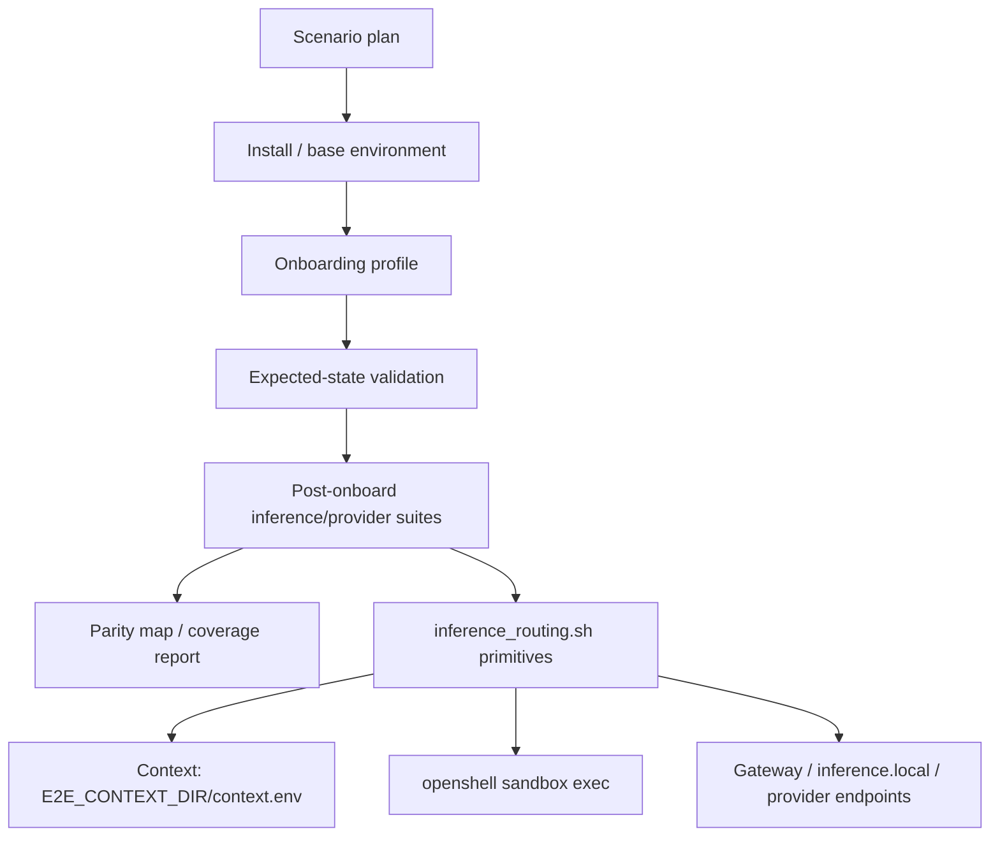

# Specification: Inference Routing and Provider E2E Scenario Migration

Issue: #3812  
Parent epic: #3588  
Created: 2026-05-20  
Worktree: `/Users/jyaunches/Development/NemoClaw-working/issue-3812`

## Overview & Objectives

Migrate the inference-routing and provider E2E coverage area into NemoClaw's layered scenario framework without porting legacy scripts line-for-line. The migration must add a reusable inference routing primitive layer, move the highest-value assertions into scenario suite steps with stable assertion IDs, and explicitly classify any remaining legacy assertions as covered, deferred, or retired.

The feature is complete when:

1. A PR is opened and all added/static scenario-framework tests pass.
2. A re-review of the relevant legacy E2E coverage shows 100% or greater parity for onboarding/inference-routing coverage: every legacy assertion from the target scripts is either migrated to a scenario assertion, already covered by an existing scenario assertion, intentionally deferred with metadata, or intentionally retired with metadata.

## Current State Analysis

### Existing scenario framework

The scenario framework already has the main execution layers:

```text
base environment setup
  -> onboarding decision/profile execution
  -> expected-state validation
  -> post-onboard validation suites
  -> parity / coverage reporting
```

Relevant files:

- `test/e2e/runtime/run-scenario.sh`
- `test/e2e/runtime/run-suites.sh`
- `test/e2e/runtime/lib/context.sh`
- `test/e2e/validation_suites/suites.yaml`
- `test/e2e/docs/parity-map.yaml`
- `test/e2e/scenario-framework-tests/*.test.ts`

### Gap

The inference/provider domain is not yet represented as first-class scenario behavior. `test/e2e/validation_suites/suites.yaml` currently maps several domain suite names to generic inference steps, including:

- `inference-routing`
- `openai-compatible-inference`
- `inference-switch`
- `kimi-compatibility`
- `ollama-auth-proxy`

This gives partial smoke coverage, but it does not preserve the highest-value legacy assertions around provider route selection, switched inference state, Kimi compatibility, Ollama auth-proxy behavior, or model-router routed inference.

### Legacy coverage to absorb

Target scripts from issue #3812:

- `test/e2e/test-inference-routing.sh`
- `test/e2e/test-openclaw-inference-switch.sh`
- `test/e2e/test-kimi-inference-compat.sh`
- `test/e2e/test-ollama-auth-proxy-e2e.sh`
- `test/e2e/test-model-router-provider-routed-inference.sh`

The migration must not copy these scripts verbatim. Instead, it must extract their durable behavioral assertions into the layered framework.

## Architecture Design

### Target layering



### Primitive library

Add `test/e2e/validation_suites/lib/inference_routing.sh` as the domain primitive layer, following the existing validation-suite shell-helper pattern.

Responsibilities:

- Source `test/e2e/runtime/lib/env.sh` and `test/e2e/runtime/lib/context.sh` directly, as existing suite scripts do.
- Consume only `$E2E_CONTEXT_DIR/context.env` for scenario state.
- Require context explicitly with `e2e_context_require` at the narrowest helper/suite boundary.
- Use `e2e_env_is_dry_run` for dry-run / plan-only behavior without live infrastructure.
- Provide bounded helper functions for:
  - sandbox HTTP status checks
  - sandbox JSON requests to `https://inference.local/v1/*`
  - model list / health probing
  - provider route inspection
  - auth-proxy positive and negative checks
  - response content checks that avoid leaking secrets
- Emit stable assertion IDs using `<layer>.<domain>.<behavior>` before performing each check.

Non-goals:

- Do not reinstall NemoClaw.
- Do not rerun onboarding from validation suites.
- Do not rediscover setup state by scanning arbitrary host state when context already provides it.
- Do not move product CLI/provider code as part of this test migration unless a blocking product bug is discovered and split into a dedicated fix.

### Suite organization

Add or extend domain-specific suite scripts under `test/e2e/validation_suites/inference/`, reusing the existing `inference/cloud/` and `inference/ollama-auth-proxy/` directories where their current steps already express the domain behavior. Add new directories only for behaviors that currently alias generic cloud inference:

```text
test/e2e/validation_suites/
  lib/
    inference_routing.sh
  inference/
    cloud/                         # existing generic cloud checks; keep only generic behavior here
    routing/
      00-inference-local-chat-completion.sh
      01-provider-route-health.sh
    switch/
      00-route-state-updated.sh
      01-switched-inference-local-chat.sh
    kimi-compatibility/
      00-plugin-wiring.sh
      01-kimi-compatible-models-route.sh
    ollama-auth-proxy/
      00-proxy-reachable.sh        # existing, may be extended
      01-auth-enforcement.sh
    model-router/
      00-healthy-endpoint.sh
      01-provider-routed-completion.sh
```

Exact filenames may change during implementation, but the suite family entries in `suites.yaml` must point at domain-specific steps rather than generic aliases where behavior differs. Prefer editing existing suite-family entries in place over adding parallel suite names.

### Assertion ID strategy

Use stable IDs with this shape:

```text
<layer>.<domain>.<behavior>
```

Examples:

- `post-onboard.inference-routing.inference-local-chat-completion`
- `post-onboard.inference-routing.provider-route-healthy`
- `post-onboard.inference-switch.route-state-updated`
- `post-onboard.inference-switch.switched-chat-completion`
- `post-onboard.kimi-compatibility.plugin-wired`
- `post-onboard.kimi-compatibility.models-route-reachable`
- `post-onboard.ollama-auth-proxy.unauthenticated-request-rejected`
- `post-onboard.ollama-auth-proxy.authenticated-request-accepted`
- `post-onboard.model-router.healthy-endpoint-reported`
- `post-onboard.model-router.provider-routed-completion`

If a behavior belongs before expected-state validation, add/extend onboarding profile assertions instead of forcing it into a post-onboard suite.

## Configuration & Deployment Changes

No production deployment changes are expected.

Expected test/config changes:

- `test/e2e/validation_suites/lib/inference_routing.sh` added.
- `test/e2e/validation_suites/suites.yaml` updated with domain-specific suite families/steps.
- `test/e2e/docs/parity-map.yaml` updated with migrated/deferred/retired assertion metadata.
- Scenario framework tests updated only when existing schema or convention tests fail for the new domains.

Environment and runner requirements must be represented in parity metadata where applicable:

- `NVIDIA_API_KEY` or other provider credentials when live cloud inference is required.
- Docker/OpenShell/NemoClaw runner for sandbox-backed tests.
- Ollama/local model runner where local Ollama behavior is validated.
- Kimi-compatible mock endpoint or fixture requirements where Kimi compatibility is validated.

Do not add new external dependencies for the migration; use Bash, existing runtime helpers, `openshell sandbox exec`, `curl`, and existing npm/Vitest scenario-framework tests.

## Validation Strategy

Validation has two gates.

### Gate 1: PR and added tests pass

When the PR is opened, all tests added or affected by the migration must pass, including static scenario-framework validation. Minimum expected commands:

```bash
npm test -- test/e2e/scenario-framework-tests/e2e-legacy-assertion-inventory.test.ts
npm test -- test/e2e/scenario-framework-tests/e2e-lib-helpers.test.ts
npm test -- test/e2e/scenario-framework-tests/e2e-scenario-resolver.test.ts
npm test -- test/e2e/scenario-framework-tests/e2e-scenario-schema.test.ts
npm test -- test/e2e/scenario-framework-tests/e2e-suite-runner.test.ts
npm test -- test/e2e/scenario-framework-tests/e2e-parity-map.test.ts
npm test -- test/e2e/scenario-framework-tests/e2e-coverage-report.test.ts
npm test -- test/e2e/scenario-framework-tests/e2e-convention-lint.test.ts
```

Also run plan-only checks for affected scenario IDs once final IDs are known:

```bash
bash test/e2e/runtime/run-scenario.sh <scenario-id> --plan-only
```

### Gate 2: Legacy coverage parity review

Re-review the legacy target scripts and `test/e2e/docs/parity-map.yaml` after implementation. The parity review passes only when each assertion from the five target legacy scripts has one of these outcomes:

- `migrated`: covered by a stable scenario assertion ID.
- `covered`: already covered by an existing scenario assertion ID.
- `deferred`: intentionally not migrated yet, with `layer`, `gap_domain`, `owner`, and runner/secret requirement metadata.
- `retired`: intentionally obsolete or no longer meaningful, with reviewer/approval metadata.

The coverage result must be 100% or greater parity, meaning no assertion remains unknown, unmapped, or silently dropped.

## Phase 1: Coverage Inventory and Parity Baseline

Create a precise baseline of the legacy assertions and decide which behaviors migrate now.

Implementation tasks:

- Inventory assertions from the five target scripts.
- Group assertions by domain:
  - generic inference routing
  - OpenAI-compatible inference
  - inference provider switching
  - Kimi compatibility
  - Ollama auth proxy
  - model-router provider routed inference
  - setup/install/cleanup scaffolding
  - secret exposure / credential hygiene
- Identify assertions already covered by existing suites.
- Select highest-value assertions to migrate into scenario suites.
- Mark setup-only or duplicated assertions as candidates for deferred/retired classification.

Acceptance criteria:

- A working inventory exists in `parity-map.yaml` or a generated/intermediate review artifact.
- Every target script has an explicit migration plan.
- No assertion is planned to be dropped without classification.

Test requirements:

- Static parity-map tests still pass if metadata is updated in this phase.
- No live E2E execution is required for this phase.

## Phase 2: Inference Routing Primitive Library

Add reusable shell primitives for inference/provider scenario suites.

Implementation tasks:

- Add `test/e2e/validation_suites/lib/inference_routing.sh`.
- Implement helper functions for bounded sandbox execution and HTTP probing; every live `curl` path must use `--max-time`.
- Ensure helpers consume `$E2E_CONTEXT_DIR/context.env` via runtime context helpers.
- Ensure dry-run/plan-only behavior emits intended checks without requiring live infrastructure.
- Ensure helpers redact or avoid printing secrets; use `e2e_context_dump` only when redacted context output is needed.
- Keep helper functions small and shellcheck-compatible under `set -euo pipefail`.

Acceptance criteria:

- Library can be sourced by suite scripts under `set -euo pipefail`.
- Library fails clearly when required context is missing.
- Library uses bounded `curl`/OpenShell invocations.
- Library does not reinstall, onboard, or rediscover setup state outside context.

Test requirements:

- Add or extend scenario-framework helper tests to validate sourceability/conventions.
- Existing shellcheck/convention tests pass.

## Phase 3: Domain Suite Migration

Move selected highest-value assertions into domain-specific validation suites.

Implementation tasks:

- Add domain suite scripts under `test/e2e/validation_suites/inference/`.
- Update `test/e2e/validation_suites/suites.yaml` so affected suite families use domain-specific steps.
- Preserve existing plan-only behavior in `run-scenario.sh`.
- Keep generic cloud inference steps only where they truly represent the intended assertion.

Minimum migrated behaviors:

- `inference.local` chat completion from inside sandbox succeeds for routed provider.
- Provider route/health can be inspected or confirmed where the scenario expects it.
- Inference switch updates registry/session/config state and produces a switched completion; state assertions should reuse or extend `onboarding/state/*provider-model-policies.sh` where practical instead of duplicating registry/session parsing.
- Ollama auth proxy rejects unauthenticated/wrong-token requests and accepts valid-token requests where runner supports it.
- Kimi compatibility route/plugin behavior is represented by stable assertions.
- Model-router reports healthy endpoint and returns a provider-routed completion where runner supports it.

Acceptance criteria:

- New suite steps use `inference_routing.sh` primitives.
- Stable assertion IDs are emitted for migrated behaviors.
- `run-scenario.sh <id> --plan-only` works for affected scenario families.
- `suites.yaml` no longer maps issue #3812 domain families to generic cloud steps where a domain-specific assertion exists.

Test requirements:

- Scenario resolver/schema/suite-runner tests pass.
- Add tests for any new suite naming/schema expectations.

## Phase 4: Parity Map and Coverage Report Completion

Make coverage reporting prove the migration is complete.

Implementation tasks:

- Update `test/e2e/docs/parity-map.yaml` for all target legacy assertions.
- Add metadata required by issue #3812:
  - `layer`
  - `gap_domain`
  - `owner`
  - runner requirements
  - secret requirements
- Link migrated/covered assertions to stable assertion IDs.
- Classify remaining assertions as deferred or retired with reasons.
- Ensure the coverage report exposes this domain as covered/deferred/retired, not invisible.

Acceptance criteria:

- No target-script assertion remains unmapped/unknown.
- Coverage report shows inference routing/provider coverage explicitly.
- The legacy coverage parity review reaches 100% or greater parity.

Test requirements:

- `e2e-parity-map.test.ts` passes.
- `e2e-coverage-report.test.ts` passes.

## Phase 5: PR Validation and Live-Capable Verification

Validate the branch for review and provide evidence in the PR.

Implementation tasks:

- Run all added/affected scenario-framework tests.
- Run plan-only checks for affected scenarios.
- If credentials/runner are available, run targeted live scenario suites for the migrated domains.
- Document any live runs that are intentionally not possible in the current environment and point to parity metadata for deferred live requirements.
- Open the PR for issue #3812.

Acceptance criteria:

- PR is open.
- Added/affected tests pass.
- PR description includes the parity review result and the validation commands/results.
- Any deferred assertions have explicit metadata and owner.

Test requirements:

- Static test gate must pass before PR review.
- Live E2E execution is required only where runner/secrets are available; otherwise plan-only plus parity metadata is the required evidence.

## Risks & Mitigations

| Risk | Mitigation |
|---|---|
| Legacy scripts include setup assertions that do not belong in post-onboard suites | Classify setup assertions as covered by base/onboarding layers, deferred, or retired with metadata |
| Live provider tests require unavailable secrets | Preserve runner/secret requirements in parity metadata and keep plan-only/static tests deterministic |
| New shell helpers introduce hangs | Use bounded `curl --max-time` and avoid unbounded OpenShell calls where possible |
| Coverage report overstates migration | Require every target legacy assertion to have explicit mapped/deferred/retired status |
| Product bugs discovered during migration | Split product fixes into separate issues/PRs unless blocking test migration |

## Implementation Decisions

1. Kimi compatibility and model-router coverage should be owned by the existing scenario IDs that already select those suite families, if present; otherwise add the smallest static fixture/scenario entry needed for resolver and plan-only coverage. Live execution remains gated by runner/secret metadata.
2. Model-router provider-routed inference should be a separate `model-router` suite family because its endpoint health and routed-completion assertions are distinct from generic `inference-routing`.
3. Credential hygiene assertions from `test-inference-routing.sh` should map to existing `security-credentials` assertions when they verify no raw secrets are exposed; only route-specific secret behavior should stay in inference/provider parity metadata.
4. “100% or greater parity” is demonstrated by `npm test -- test/e2e/scenario-framework-tests/e2e-parity-map.test.ts test/e2e/scenario-framework-tests/e2e-coverage-report.test.ts` plus a post-implementation review confirming every assertion from the five target scripts is `migrated`, `covered`, `deferred`, or `retired`.
