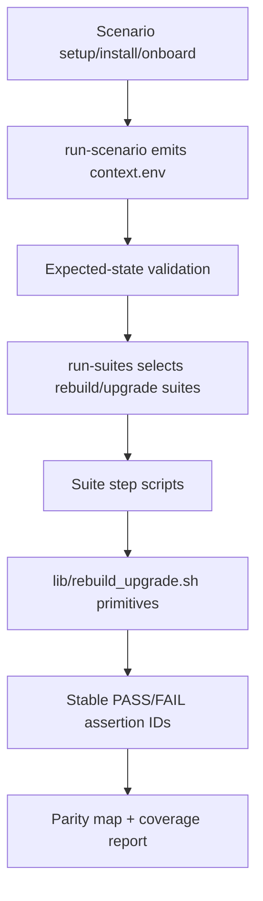

<!-- SPDX-FileCopyrightText: Copyright (c) 2026 NVIDIA CORPORATION & AFFILIATES. All rights reserved. -->
<!-- SPDX-License-Identifier: Apache-2.0 -->

# Specification: Issue #3814 — Rebuild/Upgrade Scenario Suite Migration

## Overview

Issue #3814 migrates NemoClaw rebuild and upgrade E2E coverage from monolithic legacy scripts into the layered scenario framework. The implementation must add the missing rebuild/upgrade primitive layer, move highest-value assertions into scenario validation suites with stable assertion IDs, and prove that the migrated scenario coverage reaches 100% or greater parity with the relevant legacy E2E assertions.

This is a test-framework migration, not a product behavior change. The migrated suites must consume scenario context emitted by `run-scenario.sh`; they must not reinstall NemoClaw, rerun onboarding, or rediscover setup state.

## Objectives

1. Add a reusable rebuild/upgrade domain primitive library under `test/e2e/validation_suites/lib/rebuild_upgrade.sh`.
2. Replace placeholder `rebuild` and `upgrade` suite entries with focused scenario-suite steps.
3. Migrate the highest-value assertions from these legacy scripts:
   - `test/e2e/test-rebuild-openclaw.sh`
   - `test/e2e/test-rebuild-hermes.sh`
   - `test/e2e/test-upgrade-stale-sandbox.sh`
   - `test/e2e/test-openshell-gateway-upgrade.sh`
4. Emit stable assertion IDs using the format `<layer>.<domain>.<behavior>`.
5. Update `test/e2e/docs/parity-map.yaml` so every relevant legacy assertion is mapped, deferred, or retired with metadata.
6. Preserve `run-scenario.sh <id> --plan-only` behavior.
7. Validate the PR by passing all added tests and by re-reviewing legacy E2E coverage to prove 100% or greater parity.

## Non-Goals

- Do not port legacy scripts line-for-line.
- Do not add a separate failing-test-first regression guard PR.
- Do not schedule new nightly E2E jobs as part of this issue unless an existing scenario already schedules the selected suites.
- Do not make suite scripts install, onboard, or create sandboxes independently.
- Do not change product rebuild/upgrade behavior unless a migrated test exposes an unrelated defect, which should be handled separately.

## Current State Analysis

### Existing Scenario Framework

The scenario framework already includes:

- Scenario resolver and plan rendering under `test/e2e/runtime/`.
- Context emission through `$E2E_CONTEXT_DIR/context.env`.
- Suite metadata in `test/e2e/validation_suites/suites.yaml`.
- Suite runner in `test/e2e/runtime/run-suites.sh`.
- Framework tests under `test/e2e/scenario-framework-tests/`.
- Parity tracking in `test/e2e/docs/parity-map.yaml` and `test/e2e/docs/parity-inventory.generated.json`.

### Current Gap

`suites.yaml` contains `rebuild` and `upgrade` suite families, but they currently reuse generic smoke checks. That makes the domain visible without proving rebuild/upgrade-specific behavior.

The four legacy scripts contain valuable assertions for durable state, version upgrades, gateway survival, registry preservation, policy preservation, and post-upgrade functionality. Those assertions must be moved into stable, context-driven scenario suites.

## Architecture Design

### Layered Flow



### Design Principles

1. **Context-first**: suite scripts source `$E2E_CONTEXT_DIR/context.env` and require keys such as `E2E_SCENARIO`, `E2E_AGENT`, `E2E_SANDBOX_NAME`, and `E2E_GATEWAY_URL`.
2. **Primitive-driven**: repeated rebuild/upgrade checks live in `lib/rebuild_upgrade.sh` rather than in each suite step.
3. **Stable IDs**: user-visible assertions use stable IDs such as `suite.rebuild.workspace_state_preserved`.
4. **No setup rediscovery**: suites validate the environment provided by the scenario runner; they do not install, onboard, or infer hidden state from scratch.
5. **Parity-auditable**: every relevant legacy assertion has an explicit `mapped`, `deferred`, or `retired` status.

### Proposed File Layout

```text
test/e2e/validation_suites/
├── lib/
│   └── rebuild_upgrade.sh
├── rebuild_upgrade/
│   ├── 00-state-preserved.sh
│   ├── 01-agent-version-upgraded.sh
│   ├── 02-post-rebuild-inference.sh
│   ├── 03-policy-config-preserved.sh
│   └── 04-upgrade-survivor-reachable.sh
└── suites.yaml

test/e2e/scenario-framework-tests/
├── e2e-rebuild-upgrade-suite.test.ts
├── e2e-parity-map.test.ts
└── e2e-coverage-report.test.ts

test/e2e/docs/
└── parity-map.yaml
```

Exact step filenames may change during implementation, but the final suite must remain focused and assertion-driven.

## Stable Assertion ID Plan

Candidate migrated IDs:

| ID | Legacy Source | Behavior |
|----|---------------|----------|
| `suite.rebuild.workspace_state_preserved` | `test-rebuild-openclaw.sh`, `test-rebuild-hermes.sh` | Durable workspace/memory marker survives rebuild |
| `suite.rebuild.agent_version_upgraded` | `test-rebuild-openclaw.sh`, `test-rebuild-hermes.sh` | Agent binary version is no longer stale after rebuild |
| `suite.rebuild.inference_still_works` | `test-rebuild-openclaw.sh`, `test-rebuild-hermes.sh` | Inference path works after rebuild |
| `suite.rebuild.policy_presets_preserved` | `test-rebuild-openclaw.sh` | Policy presets survive rebuild in registry and live gateway policy |
| `suite.rebuild.hermes_config_preserved` | `test-rebuild-hermes.sh` | Hermes config and env survive rebuild |
| `suite.upgrade.sandbox_registry_preserved` | `test-upgrade-stale-sandbox.sh`, `test-openshell-gateway-upgrade.sh` | Existing sandbox remains registered after upgrade |
| `suite.upgrade.gateway_version_upgraded` | `test-openshell-gateway-upgrade.sh` | Gateway reports expected OpenShell version after upgrade |
| `suite.upgrade.survivor_agent_reachable` | `test-openshell-gateway-upgrade.sh` | Survivor sandbox and agent remain reachable after upgrade |

Implementation must confirm the final IDs against the extracted legacy inventory and avoid duplicate IDs unless explicitly marked `reusable: true`.

## Configuration & Deployment Changes

No production deployment changes are expected.

Potential test metadata updates:

- `test/e2e/validation_suites/suites.yaml`
- `test/e2e/docs/parity-map.yaml`
- Scenario framework tests under `test/e2e/scenario-framework-tests/`

Potential environment/context expectations:

- `E2E_CONTEXT_DIR`
- `E2E_SCENARIO`
- `E2E_AGENT`
- `E2E_SANDBOX_NAME`
- `E2E_GATEWAY_URL`
- Optional expected version keys if already emitted by scenario setup, or helper-level fallback commands if available through the existing sandbox/gateway interface.

## Acceptance Criteria

1. Domain primitive helpers exist and are used by migrated suite steps.
2. `rebuild` and `upgrade` suite families execute rebuild/upgrade-specific checks, not only generic smoke steps.
3. At least the highest-value assertions from the listed legacy scripts are mapped to stable scenario assertion IDs.
4. Remaining relevant legacy assertions are explicitly classified as `deferred` or `retired` with layer/domain metadata.
5. Scenario framework tests pass for resolver/schema/suite/parity-map validation.
6. `run-scenario.sh <id> --plan-only` remains compatible for affected scenarios.
7. The coverage report makes rebuild/upgrade coverage visible as covered, deferred, or retired.
8. PR validation is complete when:
   - the PR is opened and all added tests pass; and
   - a re-review of legacy E2E onboarding/rebuild/upgrade coverage shows 100% or greater parity.

## Phase 1: Legacy Assertion Inventory and Parity Baseline

### Goal

Establish the exact legacy assertion baseline for rebuild/upgrade coverage and decide which assertions are mapped, deferred, or retired.

### Work Items

- Review extracted assertions for:
  - `test/e2e/test-rebuild-openclaw.sh`
  - `test/e2e/test-rebuild-hermes.sh`
  - `test/e2e/test-upgrade-stale-sandbox.sh`
  - `test/e2e/test-openshell-gateway-upgrade.sh`
- Group assertions by behavior domain:
  - rebuild state preservation
  - agent version upgrade
  - inference after rebuild
  - policy/config preservation
  - stale sandbox upgrade
  - OpenShell gateway upgrade
  - survivor sandbox reachability
- Draft stable IDs for highest-value assertions.
- Decide which legacy assertions are setup-only, duplicate, implementation-specific, or obsolete.

### Acceptance Criteria

- A local mapping table exists in the implementation notes or PR body.
- No relevant legacy assertion is left unreviewed.
- Proposed mapped/deferred/retired decisions are ready to encode in `parity-map.yaml`.

## Phase 2: Rebuild/Upgrade Primitive Library

### Goal

Add reusable shell helpers for rebuild/upgrade suite steps.

### Work Items

- Create `test/e2e/validation_suites/lib/rebuild_upgrade.sh`.
- Source existing context/logging helpers.
- Add context validation for required keys.
- Add primitive functions for checks such as:
  - sandbox exists/is reachable
  - marker file or durable state is preserved
  - agent binary reports expected/non-stale version
  - inference works after rebuild
  - policy presets/config are preserved
  - gateway reports upgraded version
  - survivor sandbox remains registered and reachable
- Keep helper functions command-injectable or mockable for tests.

### Acceptance Criteria

- Helper library can be sourced by a shell script without side effects.
- Helpers fail with clear messages when required context is missing.
- Helpers do not install, onboard, rebuild, or rediscover setup state.
- Unit-style shell/helper tests or framework tests cover missing-context and success/failure paths using fakes.

## Phase 3: Scenario Suite Steps and Suite Metadata

### Goal

Wire rebuild/upgrade-specific checks into the scenario suite framework.

### Work Items

- Add focused suite scripts under `test/e2e/validation_suites/rebuild_upgrade/` or equivalent.
- Update `test/e2e/validation_suites/suites.yaml` so:
  - `rebuild` points to rebuild-specific suite steps.
  - `upgrade` points to upgrade-specific suite steps.
- Preserve existing generic smoke coverage through separate smoke suite inclusion where needed.
- Ensure scripts emit stable assertion IDs in PASS/FAIL messages.
- Ensure scripts work under the suite runner and respect `E2E_DRY_RUN` if applicable.

### Acceptance Criteria

- `run-suites.sh rebuild` resolves the new rebuild steps.
- `run-suites.sh upgrade` resolves the new upgrade steps.
- Suite scripts are executable, shellcheck-compatible, and source the primitive library.
- `run-scenario.sh <affected-id> --plan-only` still succeeds.

## Phase 4: Parity Map and Coverage Report Integration

### Goal

Make rebuild/upgrade migration auditable and visible in the parity tooling.

### Work Items

- Update `test/e2e/docs/parity-map.yaml` for the four legacy scripts.
- Mark highest-value assertions as `mapped` with stable IDs.
- Mark remaining assertions as `deferred` or `retired` with required metadata.
- Include metadata such as:
  - `layer`
  - `gap_domain`
  - `owner`
  - `runner_requirement`
  - `secret_requirement`, where applicable
  - `reason` for deferred/retired assertions
  - `reviewer` and `approved_at` where required by existing schema
- Extend coverage-report tests if needed so rebuild/upgrade visibility is protected.

### Acceptance Criteria

- Parity-map validation passes in non-strict and strict modes where applicable.
- Coverage report includes rebuild/upgrade mapped/deferred/retired counts.
- Duplicate stable IDs are intentional and marked reusable where appropriate.
- No relevant legacy assertion remains uncategorized.

## Phase 5: PR Validation and 100%+ Parity Review

### Goal

Validate the implementation by passing all added tests and proving coverage parity against legacy E2E runs.

### Work Items

- Run targeted scenario-framework tests.
- Run parity-map validation.
- Run coverage report generation/checks.
- Re-review the relevant legacy E2E onboarding/rebuild/upgrade coverage against migrated scenario assertions.
- Document the parity result in the PR body or implementation notes.
- Remove temporary scripts, logs, scratch files, or local generated artifacts not intended for commit.
- Resolve TODO comments introduced during the implementation or convert them to tracked issues.
- Update `README.md`, `AGENTS.md`, or `test/e2e/README.md` only if contributor commands or expectations changed.
- Run formatting/linting for touched files.

### Acceptance Criteria

- All added tests pass locally and in CI.
- The PR includes a clear validation note showing 100% or greater parity with the reviewed legacy E2E coverage.
- Any coverage beyond parity is identified as new mapped coverage rather than accidental duplication.
- `git status` contains only intentional source/test/spec changes before PR creation.
- Documentation is updated if contributor commands or expectations changed.

## Validation Plan Summary

Detailed validation will be captured in `validation.md`, but the required validation gates are:

1. **PR/test gate**: after the PR is opened, all added tests pass.
2. **Parity gate**: re-review legacy E2E onboarding/rebuild/upgrade coverage and confirm 100% or greater parity.

Suggested commands:

```bash
npm test -- test/e2e/scenario-framework-tests
npx tsx scripts/e2e/check-parity-map.ts --root . --strict
bash test/e2e/runtime/run-scenario.sh <affected-rebuild-scenario> --plan-only
bash test/e2e/runtime/run-scenario.sh <affected-upgrade-scenario> --plan-only
```

The final implementation may add more targeted commands as suite IDs and scenarios are finalized.
