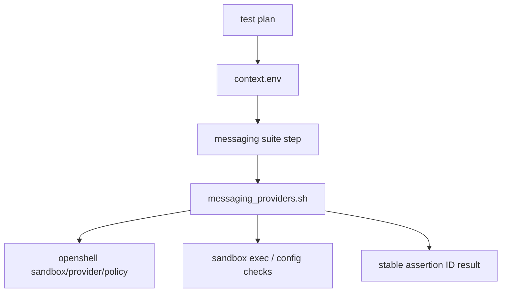

# Specification: Messaging Provider Scenario Suite Migration

## Overview & Objectives

Issue #3810 migrates the `messaging-providers` E2E coverage area into NemoClaw's layered scenario framework. The goal is not to port legacy scripts line-for-line; it is to preserve the highest-value behavioral assertions behind stable scenario assertion IDs, make remaining legacy assertions explicitly visible as `deferred` or `retired`, and keep scenario execution compatible with `run-scenario.sh <id> --plan-only`.

This work supports parent epic #3588 by moving messaging coverage from monolithic legacy scripts into the layered model:

```text
base environment setup
  → onboarding decision matrix
    → expected-state validation
      → post-onboard feature suites
        → parity / coverage reporting
```

### Objectives

- Add a messaging provider primitive library at `test/e2e/validation_suites/lib/messaging_providers.sh`.
- Replace placeholder messaging suite aliases in `test/e2e/validation_suites/suites.yaml` with real messaging-domain validation steps.
- Wire messaging onboarding test plans in `test/e2e/nemoclaw_scenarios/scenarios.yaml` to the new suites.
- Map highest-value legacy assertions from the following scripts to stable assertion IDs:
  - `test-messaging-providers.sh`
  - `test-messaging-compatible-endpoint.sh`
  - `test-channels-stop-start.sh`
  - `test-token-rotation.sh`
  - `test-telegram-injection.sh`
  - `test-brave-search-e2e.sh`
- Update `test/e2e/docs/parity-map.yaml` with `layer`, `gap_domain`, `owner`, and runner/secret requirements for covered, deferred, and retired assertions.
- Preserve plan-only behavior and scenario framework validation tests.

### Non-Goals

- Do not port every legacy script line-for-line.
- Do not reinstall, re-onboard, or rediscover setup state inside validation suites.
- Do not change production messaging implementation unless a test migration exposes a blocking product bug.
- Do not add backward-compatible legacy execution shims; the scenario model is the target path.

## Current State Analysis

### Existing Scenario Framework

NemoClaw already has the core layered scenario files:

- `test/e2e/nemoclaw_scenarios/scenarios.yaml`
- `test/e2e/nemoclaw_scenarios/expected-states.yaml`
- `test/e2e/runtime/run-scenario.sh`
- `test/e2e/runtime/run-suites.sh`
- `test/e2e/validation_suites/suites.yaml`
- `test/e2e/docs/parity-map.yaml`
- `test/e2e/scenario-framework-tests/*`

Messaging onboarding profiles already exist for Telegram, Discord, Slack, and token rotation. However, their test plans currently run mostly generic smoke coverage.

### Existing Messaging Suite State

`test/e2e/validation_suites/suites.yaml` includes these suite IDs:

- `messaging-telegram`
- `messaging-discord`
- `messaging-slack`
- `messaging-token-rotation`

At present, these suites are aliases to generic smoke steps rather than messaging-specific assertions. This makes scenario coverage appear migrated while the actual legacy messaging behavior remains mostly outside the scenario suite layer.

### Existing Helpers

`test/e2e/validation_suites/assert/messaging-bridge-reachable.sh` provides a narrow bridge reachability assertion. There is no domain primitive library for provider names, context loading, channel config inspection, registry checks, token-rotation assertions, credential leak checks, or channel lifecycle assertions.

### Legacy Coverage to Absorb

The legacy scripts cover several domains:

| Legacy Script | Main Behavior Covered | Scenario Migration Treatment |
|---|---|---|
| `test-messaging-providers.sh` | Provider creation, sandbox attachment, placeholder config, credential isolation, bridge/proxy reachability, WhatsApp QR-only behavior | Migrate highest-value provider/config/leak/reachability assertions; defer or retire low-value install scaffolding |
| `test-messaging-compatible-endpoint.sh` | Telegram + custom OpenAI-compatible endpoint, inference.local shape, proxy header stripping, OpenClaw HTTP client path | Migrate custom endpoint + messaging interaction where fixture/context support exists; otherwise defer with runner requirements |
| `test-channels-stop-start.sh` | Stop/start/remove lifecycle across agents/channels | Migrate state assertions where lifecycle test plans can represent the setup; defer orchestration-heavy matrix coverage |
| `test-token-rotation.sh` | Provider-specific token rotation and no cross-talk | Migrate token rotation detection into `messaging-token-rotation` suite |
| `test-telegram-injection.sh` | Command injection safety through Telegram bridge execution path | Migrate high-risk injection payload assertions into a security/messaging validation step |
| `test-brave-search-e2e.sh` | Brave search key, policy, no-leak, real search path | Treat primarily as web-search coverage; only cross-reference from messaging parity if needed |

## Architecture Design

### Layering Contract

Messaging suite scripts must consume prepared state from `$E2E_CONTEXT_DIR/context.env`. They must not perform installation, onboarding, sandbox discovery, or provider rediscovery beyond reading the normalized context and invoking assertions against the named sandbox/gateway.



### Primitive Library

Create `test/e2e/validation_suites/lib/messaging_providers.sh` as the shared domain API for suite scripts. This library should directly source and reuse `test/e2e/runtime/lib/context.sh` and `test/e2e/runtime/lib/logging.sh` rather than reimplementing context parsing or PASS/FAIL output.

Required capabilities:

- Load and validate `$E2E_CONTEXT_DIR/context.env` through `e2e_context_require` / `e2e_context_get`.
- Resolve active sandbox name, agent, provider, messaging channel, and expected config paths from normalized `E2E_*` context keys.
- Derive provider names for Telegram, Discord, Slack, and WhatsApp QR-only cases covered by the legacy messaging scripts.
- Inspect provider existence via OpenShell.
- Inspect sandbox-side agent config:
  - OpenClaw: `/sandbox/.openclaw/openclaw.json`
  - Hermes: `/sandbox/.hermes/.env`
- Verify placeholder-based credential wiring rather than raw token material.
- Verify raw credentials do not appear in sandbox env/config/process surfaces where feasible.
- Verify messaging bridge reachability by wrapping or extending `test/e2e/validation_suites/assert/messaging-bridge-reachable.sh`.
- Parse or verify token-rotation signals without cross-provider false positives.
- Emit results through existing `e2e_pass` / `e2e_fail` logging helpers, with stable assertion IDs included in the message text.

### Stable Assertion ID Convention

All new migrated assertions must use:

```text
<layer>.<domain>.<behavior>
```

Recommended domains:

- `expected-state.messaging.telegram.*`
- `expected-state.messaging.discord.*`
- `expected-state.messaging.slack.*`
- `expected-state.messaging.token-rotation.*`
- `post-onboard.messaging.lifecycle.*`
- `post-onboard.messaging.compatible-endpoint.*`
- `post-onboard.security.telegram-injection.*`
- `post-onboard.web-search.brave.*` for Brave-specific assertions

Example IDs:

- `expected-state.messaging.telegram.provider-attached`
- `expected-state.messaging.telegram.placeholder-configured`
- `expected-state.messaging.discord.bridge-reachable`
- `expected-state.messaging.slack.no-secret-leak`
- `post-onboard.messaging.token-rotation.telegram-isolated`
- `post-onboard.security.telegram-injection.command-substitution-blocked`

### Suite Structure

Add scripts under `test/e2e/validation_suites/messaging/` only for assertions that are wired in `suites.yaml` during this migration:

```text
test/e2e/validation_suites/
├── lib/
│   └── messaging_providers.sh
└── messaging/
    ├── common/
    │   ├── 00-provider-attached.sh
    │   ├── 01-placeholder-configured.sh
    │   ├── 02-no-secret-leak.sh
    │   └── 03-bridge-reachable.sh
    ├── telegram/
    │   └── 00-telegram-injection-safety.sh
    ├── discord/
    │   └── 00-discord-gateway-path.sh
    ├── slack/
    │   └── 00-slack-provider-state.sh
    └── token-rotation/
        └── 00-provider-rotation-isolated.sh
```

Defer lifecycle or compatible-endpoint scripts until a scenario can provide the required state; represent those gaps in `parity-map.yaml` instead of adding unwired placeholder scripts. Exact file names may be adjusted during implementation, but scripts should remain small and map clearly to assertions.

### Suite YAML Changes

Replace smoke aliases in `test/e2e/validation_suites/suites.yaml` with messaging-specific steps:

- `messaging-telegram`: common provider/config/leak/bridge steps plus Telegram-specific injection safety when supported.
- `messaging-discord`: common provider/config/leak/bridge steps plus Discord gateway path where supported.
- `messaging-slack`: common provider/config/leak/bridge steps plus Slack bot/app provider assertions.
- `messaging-token-rotation`: token rotation and no cross-talk assertions.

### Scenario YAML Changes

Update `test/e2e/nemoclaw_scenarios/scenarios.yaml` so existing messaging plans include their corresponding suite IDs:

- `ubuntu-repo-docker__cloud-nvidia-openclaw-telegram` → `messaging-telegram`
- `ubuntu-repo-docker__cloud-nvidia-openclaw-discord` → `messaging-discord`
- `ubuntu-repo-docker__cloud-nvidia-openclaw-slack` → `messaging-slack`
- `ubuntu-repo-docker__cloud-nvidia-hermes-discord` → `messaging-discord`
- `ubuntu-repo-docker__cloud-nvidia-hermes-slack` → `messaging-slack`
- `ubuntu-repo-docker__cloud-nvidia-openclaw-token-rotation` → `messaging-token-rotation`

Only add onboarding assertions or new profiles if a behavior truly belongs before expected-state validation.

### Parity Map Changes

Update `test/e2e/docs/parity-map.yaml` for the six legacy scripts. Every relevant legacy assertion must be one of:

- `mapped`: has a stable migrated assertion ID.
- `deferred`: still valuable but requires unavailable runner, secret, fixture, or scenario capability.
- `retired`: no longer useful under the scenario model, usually install scaffolding or duplicate smoke behavior.

Each migrated/deferred/retired item should include:

- `layer`
- `gap_domain`
- `owner`
- `runner_requirement` where applicable
- `secret_requirement` where applicable
- `reason` for deferred/retired statuses

## Configuration & Deployment Changes

### Environment Variables

No new production environment variables are expected.

Suite scripts should consume the scenario framework's normalized `E2E_*` context variables, including:

- `E2E_CONTEXT_DIR`
- `E2E_SANDBOX_NAME`
- `E2E_AGENT`
- `E2E_PROVIDER`
- `E2E_MESSAGING_PROVIDER` if emitted for messaging onboarding profiles
- Provider tokens only as masked test inputs from existing scenarios/secrets

If `E2E_MESSAGING_PROVIDER` or another required normalized context key is missing, extend `test/e2e/nemoclaw_scenarios/helpers/emit-context-from-plan.sh` rather than rediscovering state in each suite. Do not introduce `NEMOCLAW_*` aliases in new suite code unless an existing helper already requires them.

### Dependencies

No new external dependencies are expected. Scripts should use existing shell, OpenShell, Node/Python helpers already available in the E2E environment.

### CI / Runner Requirements

Framework tests should run locally without Docker or real secrets. Live migrated suites require the same runner capability as the covered legacy behavior:

- Docker daemon
- OpenShell CLI
- NemoClaw CLI
- Sandbox-capable Linux runner
- `NVIDIA_API_KEY` for cloud inference paths
- Messaging provider test tokens only where a real provider path is intentionally retained
- `BRAVE_API_KEY` only for Brave web-search coverage, if kept in scope

## Implementation Phases

## Phase 1: Messaging Primitive Library

Create the shared primitive library and local tests that validate helper behavior without live infrastructure.

### Implementation Tasks

- Add `test/e2e/validation_suites/lib/messaging_providers.sh`.
- Implement context loading by sourcing `test/e2e/runtime/lib/context.sh` and using `e2e_context_require` / `e2e_context_get`.
- Source `test/e2e/runtime/lib/logging.sh` for assertion output.
- Implement provider-name derivation helpers.
- Implement config path and channel key helpers for OpenClaw and Hermes.
- Implement credential placeholder and no-secret-leak helper interfaces.
- Implement bridge URL resolution by composing or reusing `assert/messaging-bridge-reachable.sh`.
- Add mock-based tests in `test/e2e/scenario-framework-tests/e2e-lib-helpers.test.ts`.

### Acceptance Criteria

- Helper library can be sourced in isolation.
- Missing context fails with clear diagnostics.
- Provider-name derivation covers Telegram, Discord, Slack bot/app providers, and WhatsApp QR-only.
- Helper tests pass without Docker, OpenShell, or real provider secrets.
- No suite script performs install/onboard/discovery work.

## Phase 2: Provider Expected-State Suites

Replace placeholder messaging suite aliases with real provider expected-state checks.

### Implementation Tasks

- Add common messaging suite scripts for provider attachment, placeholder config, no-secret-leak, and bridge reachability.
- Add Telegram, Discord, and Slack-specific scripts where provider behavior differs.
- Update `test/e2e/validation_suites/suites.yaml` for `messaging-telegram`, `messaging-discord`, and `messaging-slack`.
- Update messaging test plans in `test/e2e/nemoclaw_scenarios/scenarios.yaml` to include corresponding suites.
- Ensure assertion IDs follow `<layer>.<domain>.<behavior>`.

### Acceptance Criteria

- Messaging suite IDs no longer alias generic smoke steps.
- A plan-only run for each affected messaging scenario succeeds.
- Scenario schema and resolver tests pass.
- Provider suite scripts can be skipped or fail clearly when required live context is absent.

## Phase 3: Token Rotation and Channel Lifecycle Suites

Migrate high-value token-rotation and channel lifecycle assertions into scenario-compatible suites.

### Implementation Tasks

- Add `messaging-token-rotation` suite steps for provider-specific rotation detection.
- Verify no cross-talk between Telegram, Discord, and Slack rotation signals.
- Add lifecycle-state assertions for stop/start/remove behavior where scenario setup can represent the expected state.
- Avoid embedding rebuild/onboard orchestration in validation scripts unless a lifecycle test plan explicitly created that state.

### Acceptance Criteria

- `messaging-token-rotation` has real validation steps.
- Token rotation assertions identify only the rotated provider.
- Lifecycle assertions are represented as expected-state or post-onboard checks, not hidden setup logic.
- Unsupported legacy lifecycle matrix cases are marked `deferred` with runner/context requirements.

## Phase 4: Security and Compatible Endpoint Assertions

Migrate high-risk Telegram injection and compatible-endpoint assertions where the scenario framework can provide the required state.

### Implementation Tasks

- Add Telegram injection-safety assertion scripts for command substitution, backtick, variable expansion, and shell metacharacter payload classes where feasible.
- Add compatible-endpoint assertions for custom endpoint shape, `inference.local` path, and proxy header stripping where mock endpoint context exists.
- Classify Brave search coverage as web-search domain unless an assertion directly belongs to messaging.
- Add or extend fixtures/context emission only when needed for deterministic suite execution.

### Acceptance Criteria

- High-risk injection assertions have stable IDs.
- Compatible endpoint assertions are either mapped to stable IDs or explicitly deferred with runner/fixture requirements.
- Brave search assertions are not incorrectly counted as messaging-provider coverage.
- Framework tests cover new metadata and suite wiring.

## Phase 5: Parity Map and Coverage Report Integration

Make the migrated, deferred, and retired coverage visible and accurate.

### Implementation Tasks

- Update `test/e2e/docs/parity-map.yaml` for all six legacy scripts.
- Add `layer`, `gap_domain`, `owner`, runner requirements, and secret requirements.
- Mark high-value migrated assertions as `mapped` with stable IDs.
- Mark remaining assertions as `deferred` or `retired` with explicit reasons.
- Run and update coverage report tests as needed.

### Acceptance Criteria

- Parity map validation passes.
- Coverage report shows messaging provider coverage as covered, deferred, or retired.
- No legacy assertion relevant to issue #3810 remains unclassified.
- Metadata is specific enough for future cleanup work to pick up deferred cases.

## Phase 6: Scenario Framework Validation

Validate the full migration through local framework tests and plan-only scenario execution.

### Implementation Tasks

- Run scenario framework tests for schema, resolver, suite runner, parity map, coverage report, and helper behavior.
- Run `test/e2e/runtime/run-scenario.sh <id> --plan-only` for affected messaging plans.
- Where infrastructure and secrets are available, run one representative live provider scenario and the token-rotation scenario.
- Document skipped live validation with exact missing runner/secret requirements.

### Acceptance Criteria

- All local scenario framework tests pass.
- Plan-only runs remain compatible for all affected scenarios.
- Live validation either passes or is explicitly documented as not run due to missing infrastructure/secrets.
- The migration can be reviewed without requiring every legacy live script to run.
