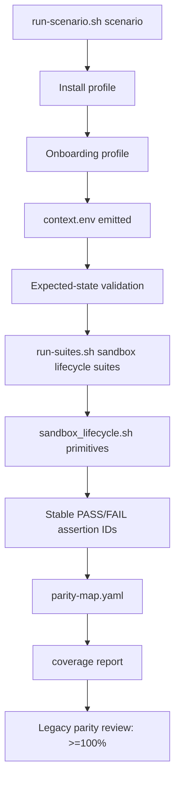

# Specification: Sandbox Lifecycle E2E Scenario Migration

## Overview & Objectives

Issue #3813 migrates the `sandbox-lifecycle` E2E coverage area into NemoClaw's layered scenario framework. The migration must absorb the highest-value assertions from these legacy scripts without porting them line-for-line:

- `test/e2e/test-sandbox-survival.sh`
- `test/e2e/test-issue-2478-crash-loop-recovery.sh`
- `test/e2e/test-sandbox-operations.sh`
- `test/e2e/test-snapshot-commands.sh`

The objective is to make sandbox lifecycle coverage visible and executable through the scenario model introduced by parent epic #3588. Suites must consume `$E2E_CONTEXT_DIR/context.env` and must not reinstall NemoClaw, rerun onboard, or rediscover setup state independently.

### Goals

1. Add a reusable sandbox lifecycle domain primitive library.
2. Add scenario-suite steps that use the primitive library and emit stable assertion IDs.
3. Replace placeholder lifecycle suite aliases with domain-specific suites.
4. Map high-value legacy assertions to stable scenario-side assertion IDs.
5. Explicitly classify remaining legacy assertions as `deferred` or `retired` with metadata.
6. Preserve `run-scenario.sh <id> --plan-only` behavior.
7. Validate that added tests pass when the PR is opened.
8. Re-review legacy E2E coverage and prove 100% or greater parity for scoped onboarding/lifecycle coverage.

### Non-Goals

- Do not rewrite the legacy scripts line-for-line.
- Do not change product sandbox lifecycle behavior in `src/` unless a real validation bug blocks the migration.
- Do not introduce a parallel E2E runner.
- Do not make install/onboard setup assertions part of expected-state lifecycle suites.
- Do not attach destructive snapshot/restore checks to scenarios where they can corrupt shared state.
- Do not require macOS hosted runners to execute Docker-dependent lifecycle checks.

## Current State Analysis

### Existing Scenario Framework

The E2E scenario system is organized into these layers:

```text
base environment setup
  → onboarding profile / test plan
    → expected-state validation
      → post-onboard validation suites
      → parity / coverage reporting
```

Key files:

- `test/e2e/nemoclaw_scenarios/scenarios.yaml` — platform, install, runtime, onboarding, setup scenarios.
- `test/e2e/nemoclaw_scenarios/expected-states.yaml` — expected state contracts.
- `test/e2e/validation_suites/suites.yaml` — suite definitions and ordered steps.
- `test/e2e/runtime/run-scenario.sh` — scenario resolver/executor.
- `test/e2e/runtime/run-suites.sh` — suite executor.
- `test/e2e/runtime/lib/context.sh` — normalized `context.env` helper.
- `test/e2e/docs/parity-map.yaml` — legacy assertion migration map.
- `test/e2e/docs/parity-inventory.generated.json` — generated legacy assertion inventory.
- `scripts/e2e/check-parity-map.ts` — parity-map validator.
- `test/e2e/scenario-framework-tests/` — resolver, schema, suite, parity, and coverage tests.

### Existing Suite Coverage

Current suites include smoke, inference, credentials, onboarding-state, platform, Hermes, Ollama, and compatibility aliases. The suite file already contains placeholder entries for lifecycle-related domains:

- `sandbox-lifecycle`
- `sandbox-operations`
- `snapshot`
- `rebuild`
- `upgrade`

However, `sandbox-lifecycle`, `sandbox-operations`, and `snapshot` currently reuse the generic smoke step anchors. This provides shallow coverage only:

- CLI available.
- Gateway health.
- Sandbox listed.
- Sandbox shell.

It does not preserve high-value lifecycle behavior from the scoped legacy scripts:

- Gateway survives or recovers from process death.
- `nemoclaw status` reports expected lifecycle fields.
- Log streaming produces usable output.
- OpenShell sandbox exec remains functional after lifecycle operations.
- Snapshot create/list/restore preserves and rolls back sandbox state.
- Crash-loop recovery from issue #2478 remains covered.

### Gap

The framework lacks:

- `test/e2e/validation_suites/lib/sandbox_lifecycle.sh`.
- Dedicated suite step scripts for lifecycle, operations, and snapshot assertions.
- Stable assertion IDs under a scenario-native namespace.
- Complete parity metadata for the scoped legacy assertions with `layer`, `gap_domain`, `owner`, and runner/secret requirements.
- A validation artifact proving scoped legacy coverage is at least 100% preserved by mapped/deferred/retired classifications and new scenario suite coverage.

## Architecture Design

### Design Principles

1. **Context-first:** Helpers read normalized setup state from `$E2E_CONTEXT_DIR/context.env`.
2. **No setup side effects in suites:** Suites validate an already-created scenario; they do not install, onboard, destroy, rebuild, or discover global state beyond context-provided IDs.
3. **Stable IDs:** Every migrated assertion emits `PASS: <layer>.<domain>.<behavior>` or `FAIL: <layer>.<domain>.<behavior>`.
4. **Domain primitive first:** Suite scripts remain thin wrappers over reusable helpers.
5. **Bounded execution:** Every CLI/process assertion must use explicit timeouts to avoid the historical unbounded OpenShell hang class tracked by #2562.
6. **Scenario-aware requirements:** Suite attachment must respect platform/runtime constraints, especially live Docker/OpenShell, NVIDIA secret, and destructive snapshot requirements.
7. **Parity visibility:** Every legacy assertion from the scoped scripts is mapped, deferred, or retired.

### Target Flow



### New Domain Primitive Library

Create:

```text
test/e2e/validation_suites/lib/sandbox_lifecycle.sh
```

Responsibilities:

- Source and reuse `test/e2e/runtime/lib/context.sh` for context path resolution, required-key validation, and redacted context dumping instead of reimplementing context parsing.
- Provide helper functions for sandbox lifecycle assertions.
- Encapsulate common command execution, timeout, polling, and output capture patterns.
- Redact sensitive context in failure output using the existing context helper conventions.
- Emit stable assertion IDs through a single helper function.
- Support `E2E_DRY_RUN=1` for framework tests and plan validation by emitting the same stable IDs without invoking live Docker/OpenShell-mutating commands.

Primitive functions:

- `sandbox_lifecycle_load_context`
- `sandbox_lifecycle_pass <id> <message>`
- `sandbox_lifecycle_fail <id> <message>`
- `sandbox_lifecycle_run_with_timeout <seconds> <command...>`
- `sandbox_lifecycle_assert_nemoclaw_list_contains_sandbox`
- `sandbox_lifecycle_assert_status_fields_present`
- `sandbox_lifecycle_assert_logs_available`
- `sandbox_lifecycle_assert_openshell_exec_ok`
- `sandbox_lifecycle_assert_gateway_health`
- `sandbox_lifecycle_assert_gateway_recovers_after_probe`
- `sandbox_lifecycle_assert_snapshot_create_list_restore_marker`

The helper library should be shellcheck-friendly and should not mutate global scenario state except for isolated marker files inside the target sandbox during snapshot validation.

### Stable Assertion ID Namespace

Use this namespace pattern:

```text
validation.sandbox_lifecycle.<behavior>
validation.sandbox_operations.<behavior>
validation.sandbox_snapshot.<behavior>
```

Initial stable IDs:

- `validation.sandbox_lifecycle.gateway_health`
- `validation.sandbox_lifecycle.gateway_recovers`
- `validation.sandbox_lifecycle.openshell_exec_after_recovery`
- `validation.sandbox_operations.sandbox_listed`
- `validation.sandbox_operations.status_fields_present`
- `validation.sandbox_operations.logs_available`
- `validation.sandbox_operations.openshell_exec_ok`
- `validation.sandbox_snapshot.marker_written`
- `validation.sandbox_snapshot.create_succeeds`
- `validation.sandbox_snapshot.list_shows_snapshot`
- `validation.sandbox_snapshot.restore_rolls_back_marker`

If repository convention requires hyphenated IDs, keep the semantic namespace but match existing validator/style expectations consistently.

### Suite Scripts

Create suite directories:

```text
test/e2e/validation_suites/sandbox/lifecycle/
test/e2e/validation_suites/sandbox/operations/
test/e2e/validation_suites/sandbox/snapshot/
```

Scripts:

```text
sandbox/lifecycle/00-gateway-health.sh
sandbox/lifecycle/01-gateway-recovery.sh
sandbox/operations/00-list-and-status.sh
sandbox/operations/01-logs-and-exec.sh
sandbox/snapshot/00-create-list-restore.sh
```

Each script should:

1. `set -euo pipefail`.
2. Source `../../lib/sandbox_lifecycle.sh` using a robust `SCRIPT_DIR` path.
3. Load context.
4. Call one or more primitive assertions.
5. Avoid install/onboard/destructive commands outside scoped snapshot marker behavior.

### Suite Definition

Update `test/e2e/validation_suites/suites.yaml`:

```yaml
sandbox-lifecycle:
  requires_state:
    gateway.health: healthy
    sandbox.status: running
  steps:
    - id: gateway-health
      script: sandbox/lifecycle/00-gateway-health.sh
    - id: gateway-recovery
      script: sandbox/lifecycle/01-gateway-recovery.sh

sandbox-operations:
  requires_state:
    gateway.health: healthy
    sandbox.status: running
  steps:
    - id: list-and-status
      script: sandbox/operations/00-list-and-status.sh
    - id: logs-and-exec
      script: sandbox/operations/01-logs-and-exec.sh

snapshot:
  requires_state:
    gateway.health: healthy
    sandbox.status: running
  steps:
    - id: create-list-restore
      script: sandbox/snapshot/00-create-list-restore.sh
```

Destructive snapshot restore validation must live in an opt-in `snapshot-lifecycle` suite and run only with `E2E_DRY_RUN=1` or an explicitly isolated context. Keep any existing `snapshot` compatibility alias non-destructive unless the current suite schema already supports a safe opt-in flag.

### Scenario Attachment

Attach non-destructive lifecycle and operations suites to scenarios where assertions are valid:

- `ubuntu-repo-cloud-openclaw`
- `ubuntu-repo-cloud-hermes` where agent-independent lifecycle checks apply
- `brev-launchable-cloud-openclaw` only if OpenShell/Docker lifecycle commands are available in that runner

Attach `snapshot-lifecycle` validation only to isolated scenarios/runs that can tolerate marker file creation, snapshot creation, restore, and rollback. Do not attach destructive snapshot validation to default shared scenario plans.

Avoid attaching Docker/sandbox-dependent lifecycle checks to:

- macOS scenarios where Docker is optional/unavailable.
- Negative preflight scenarios with no sandbox.
- Shared long-lived sandboxes where snapshot restore could discard external user state.

### Parity Map Updates

Update `test/e2e/docs/parity-map.yaml` entries for:

- `test-sandbox-survival.sh`
- `test-issue-2478-crash-loop-recovery.sh`
- `test-sandbox-operations.sh`
- `test-snapshot-commands.sh`

For mapped assertions, include:

```yaml
- legacy: "TC-SBX-03: Status output contains all expected fields"
  id: validation.sandbox_operations.status_fields_present
  status: mapped
  layer: validation
  gap_domain: sandbox-lifecycle
  owner: e2e-maintainers
```

For deferred assertions, include:

```yaml
- legacy: "Initial gateway serves inference API (https://inference.local/v1/models responds)"
  status: deferred
  reason: "requires live NVIDIA endpoint and isolated sandbox runner before default scenario attachment"
  layer: validation
  gap_domain: sandbox-lifecycle
  owner: e2e-maintainers
  runner_requirement: "Docker + OpenShell sandbox runner"
  secret_requirement: "NVIDIA_API_KEY secret and network egress"
```

For retired assertions, include:

```yaml
- legacy: "install.sh completed (exit 0)"
  status: retired
  reason: "install/onboard setup assertion belongs to scenario setup coverage, not sandbox lifecycle expected-state validation"
  layer: install
  gap_domain: sandbox-lifecycle
  reviewer: e2e-maintainers
  approved_at: "2026-05-20"
```

## Validation Definition

Validation is complete only when both of these are true:

1. **PR-open validation:** The implementation PR is opened and every test added or changed by the migration is passing in CI or an equivalent documented local run.
2. **Legacy parity validation:** The scoped legacy E2E coverage is re-reviewed and the parity report shows 100% or greater coverage parity for the migrated onboarding/lifecycle area. Every scoped legacy assertion must be mapped, deferred with explicit owner/requirements, or retired with reviewer/date evidence; no assertion may remain silently uncategorized.

The PR description must include the exact commands used for local validation and the coverage/parity evidence.

## Configuration & Deployment Changes

### New Files

- `test/e2e/validation_suites/lib/sandbox_lifecycle.sh`
- `test/e2e/validation_suites/sandbox/lifecycle/00-gateway-health.sh`
- `test/e2e/validation_suites/sandbox/lifecycle/01-gateway-recovery.sh`
- `test/e2e/validation_suites/sandbox/operations/00-list-and-status.sh`
- `test/e2e/validation_suites/sandbox/operations/01-logs-and-exec.sh`
- `test/e2e/validation_suites/sandbox/snapshot/00-create-list-restore.sh`

### Modified Files

- `test/e2e/validation_suites/suites.yaml`
- `test/e2e/nemoclaw_scenarios/scenarios.yaml` if suite attachment changes are needed.
- `test/e2e/docs/parity-map.yaml`
- Scenario framework tests under `test/e2e/scenario-framework-tests/` as needed.
- `test/e2e/docs/README.md` if new lifecycle suite conventions need explanation.

### Environment Variables

No new required environment variables should be introduced.

Existing relevant variables:

- `E2E_CONTEXT_DIR`
- `E2E_DRY_RUN`
- `E2E_SANDBOX_NAME`
- `E2E_AGENT`
- `E2E_PROVIDER`
- `E2E_GATEWAY_URL`
- `E2E_INFERENCE_ROUTE`
- `E2E_CONTAINER_ENGINE`
- `E2E_CONTAINER_DAEMON`

### Dependencies

No new npm, Python, or system dependencies should be required.

## Implementation Phases

## Phase 1: Legacy Assertion Inventory and Parity Classification [COMPLETED: 9e809ae]

### Objective

Classify scoped legacy assertions into mapped, deferred, or retired groups and define stable assertion IDs for mapped sandbox lifecycle behavior.

### Implementation Tasks

1. Extract and review PASS/FAIL strings from the four scoped legacy scripts.
2. Group assertions by layer:
   - install/setup
   - onboarding
   - expected-state validation
   - sandbox lifecycle
   - sandbox operations
   - snapshot lifecycle
   - diagnostics/cleanup
3. Select the highest-value assertions to migrate first.
4. Define stable assertion IDs under `validation.sandbox_lifecycle.*`, `validation.sandbox_operations.*`, and `validation.sandbox_snapshot.*`.
5. Identify assertions that should remain deferred due to live runner, secret, destructive operation, or diagnostic stability requirements.
6. Identify assertions that should be retired as duplicates, setup-only assertions, or obsolete cleanup checks.

### Acceptance Criteria

- Every scoped legacy script has an updated classification plan.
- Every selected mapped assertion has a stable ID.
- Every non-mapped assertion has a documented deferred or retired reason.
- The classification distinguishes setup/onboard checks from post-onboard lifecycle validation.
- Initial parity math shows how 100% or greater coverage will be demonstrated.

## Phase 2: Sandbox Lifecycle Primitive Library [COMPLETED: 1752bb4]

### Objective

Create the reusable helper layer that suite steps will call for lifecycle, operations, and snapshot assertions.

### Implementation Tasks

1. Add `test/e2e/validation_suites/lib/sandbox_lifecycle.sh`.
2. Implement context loading and required-key validation.
3. Implement stable PASS/FAIL emission helpers.
4. Implement bounded command execution helpers.
5. Implement sandbox list/status/log/exec assertions.
6. Implement gateway health and non-destructive recovery assertions as a bounded health probe/retry only; do not intentionally kill, restart, or mutate shared gateway processes in default lifecycle suites.
7. Implement snapshot marker create/list/restore assertions with isolated marker paths.
8. Add helper-level tests using temporary `context.env` and mocked command binaries.

### Acceptance Criteria

- Helper library sources cleanly under `set -euo pipefail`.
- Helper functions do not install, onboard, destroy, or mutate scenario setup outside isolated snapshot marker behavior.
- All command-running helpers have explicit timeouts.
- Helper failures include actionable command output snippets without leaking secrets.
- Helper tests cover success and failure paths for the core assertions.
- Shellcheck-compatible style is preserved.

## Phase 3: Lifecycle Suite Integration

### Objective

Expose sandbox lifecycle helper assertions through scenario validation suites.

### Implementation Tasks

1. Add lifecycle, operations, and snapshot suite step scripts.
2. Replace placeholder `sandbox-lifecycle`, `sandbox-operations`, and `snapshot` suite definitions in `suites.yaml`.
3. Attach suites to supported scenarios only if required by the scenario framework.
4. Split destructive snapshot validation into the opt-in `snapshot-lifecycle` suite.
5. Ensure each step emits stable assertion IDs through the primitive library.
6. Preserve `run-scenario.sh <id> --plan-only` output and behavior.

### Acceptance Criteria

- `run-scenario.sh ubuntu-repo-cloud-openclaw --plan-only` succeeds.
- Suite schema/resolver tests pass.
- Suite scripts consume only `context.env` and scenario-provided state.
- Docker/OpenShell-dependent steps are not attached to scenarios that cannot satisfy them.
- Snapshot validation is isolated from non-destructive lifecycle checks through the opt-in `snapshot-lifecycle` suite.

## Phase 4: Parity Map and Coverage Report Visibility

### Objective

Make sandbox lifecycle visible as covered, deferred, or retired in parity and coverage reporting.

### Implementation Tasks

1. Update `test/e2e/docs/parity-map.yaml` for the scoped legacy scripts.
2. Add `layer`, `gap_domain`, `owner`, and runner/secret metadata where applicable.
3. Mark high-value migrated assertions as `mapped` to stable IDs.
4. Mark remaining assertions as `deferred` or `retired` with evidence.
5. Run parity-map validation.
6. Run coverage report generation and verify sandbox lifecycle domain visibility.
7. Produce a short parity summary showing the scoped legacy assertions have 100% or greater coverage parity.

### Acceptance Criteria

- Parity map validation passes for the updated entries.
- No scoped assertion remains silently uncategorized.
- Coverage report shows sandbox lifecycle as mapped/deferred/retired.
- Deferred entries identify owner and runner/secret requirements.
- Retired entries include reviewer/date evidence.
- Parity summary demonstrates 100% or greater coverage for scoped legacy coverage.

## Phase 5: PR-Open and Integration Verification

### Objective

Validate the migrated suite through local/framework checks and PR CI.

### Implementation Tasks

1. Run relevant scenario framework Vitest files.
2. Run plan-only resolution for affected scenarios.
3. Run `test/e2e/runtime/run-suites.sh sandbox-lifecycle sandbox-operations` against a mocked/prepared context.
4. Run `test/e2e/runtime/run-suites.sh snapshot-lifecycle` only with `E2E_DRY_RUN=1` or against an isolated prepared context.
5. Run `npx tsx scripts/e2e/check-parity-map.ts --strict` as the canonical parity validation command, plus the existing coverage-report test/generator used by `e2e-coverage-report.test.ts`.
6. Open the implementation PR.
7. Confirm all added/changed tests pass in PR CI or document equivalent local evidence if CI cannot run live E2E.
8. Add parity summary and validation commands to the PR description.

### Acceptance Criteria

- Scenario framework tests pass.
- Plan-only scenario resolution remains stable.
- Lifecycle suites can execute with a valid context.
- Failures are reported as stable assertion IDs.
- The PR is opened.
- All added tests are passing in PR CI or equivalent documented validation.
- Legacy parity review evidence is included in the PR.

## Phase 6: Clean the House

### Objective

Remove migration leftovers and update contributor-facing documentation.

### Implementation Tasks

1. Remove any temporary scripts or generated debug files.
2. Resolve implementation TODOs or convert them to issue-linked TODOs.
3. Update `test/e2e/docs/README.md` if the new lifecycle suite changes documented conventions.
4. Update `AGENTS.md` only if repository workflow guidance changes.
5. Re-run formatting/lint checks for touched files.
6. Confirm `git status` contains only intentional changes.

### Acceptance Criteria

- No temporary files remain.
- Documentation reflects the new suite if needed.
- TODOs are either resolved or linked to issues.
- Final diff is scoped to the E2E migration.
- Validation commands and known live-run limitations are documented.

## Risks & Mitigations

| Risk | Impact | Mitigation |
|---|---|---|
| Legacy assertions rely on brittle free-text logs | Flaky scenario suite | Map only stable behavior; defer brittle diagnostics until structured signals exist |
| Suite accidentally re-discovers global state | Violates #3588 architecture | Require context loading in helper tests and avoid install/onboard commands |
| Snapshot restore mutates shared state | Data loss or flaky runner | Use isolated marker paths and attach snapshot suite only to isolated contexts |
| OpenShell or gateway commands hang | CI timeout | Add explicit helper-level timeouts per #2562 |
| One suite cannot serve all scenarios | Platform false failures | Split lifecycle, operations, and snapshot suites by capability |
| Live NVIDIA endpoint or secret requirements block local validation | Incomplete local proof | Use mocked helper tests locally; document live runner/secret requirements in parity map |
| Duplicate assertion IDs in parity map | Validation failure | Mark `reusable: true` only for semantically identical assertions |

## Test Strategy Summary

- Unit-style helper tests with temp `context.env` and mocked commands.
- Suite schema/resolver validation.
- Parity-map validation.
- Coverage-report validation.
- Plan-only scenario checks.
- Dry-run suite execution.
- Optional live validate-only suite run when a prepared isolated scenario context exists.
- PR CI validation for all added/changed tests.
- Manual/automated parity review proving 100% or greater scoped coverage parity.

## Resolved Review Decisions

1. Snapshot restore must be split into the opt-in destructive `snapshot-lifecycle` suite; default `snapshot` coverage must remain non-destructive.
2. #2478 crash-loop recovery maps only to bounded gateway health probe/retry behavior in default suites. Assertions that require intentionally killing or restarting shared gateway processes remain deferred with isolated-runner requirements.
3. Canonical parity evidence is `npx tsx scripts/e2e/check-parity-map.ts --strict` plus the existing coverage-report test/generator exercised by `test/e2e/scenario-framework-tests/e2e-coverage-report.test.ts`.
