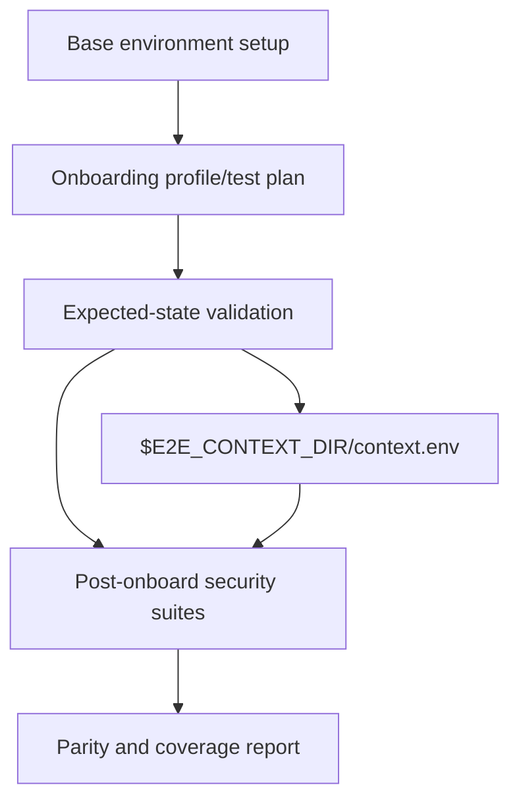

# Specification: Security Policy and Credential E2E Migration

Issue: #3815  
Parent epic: #3588  
Branch: `issue-3815-migrate-security-policy-credential-e2e`

## Overview & Objectives

Migrate the `security-policy-credentials` E2E coverage area into NemoClaw's layered scenario framework without porting legacy scripts line-for-line. The migration must preserve or improve behavioral coverage while expressing assertions as context-driven scenario suite steps with stable IDs.

Primary objectives:

1. Add a reusable domain primitive library for security policy and credential checks.
2. Replace placeholder suite aliases with focused layered scenario suite steps.
3. Map the highest-value legacy assertions to stable scenario assertion IDs using `<layer>.<domain>.<behavior>`.
4. Explicitly classify remaining legacy assertions as `deferred` or `retired` with layer/domain metadata.
5. Preserve `test/e2e/runtime/run-scenario.sh <id> --plan-only` behavior.
6. Validate completion by opening a PR with all added tests passing and confirming at least 100% parity against the existing legacy E2E coverage area.

## Current State Analysis

### Existing legacy coverage to absorb

The issue identifies these legacy scripts as the source coverage area:

- `test/e2e/test-network-policy.sh`
- `test/e2e/test-shields-config.sh`
- `test/e2e/test-credential-migration.sh`
- `test/e2e/test-credential-sanitization.sh`
- `test/e2e/test-telegram-injection.sh`
- `test/e2e/test-gateway-drift-preflight.sh`
- `test/e2e/test-gateway-health-honest.sh`
- `test/e2e/test-openshell-version-pin.sh`

These scripts mix setup, environment discovery, onboarding, expected-state checks, feature validation, and negative security assertions. The layered scenario model needs only the behavior-specific assertions in suite steps; setup and onboarding must remain in earlier scenario layers.

### Existing layered scenario framework

Relevant files:

- `test/e2e/runtime/run-scenario.sh`
- `test/e2e/runtime/lib/context.sh`
- `test/e2e/nemoclaw_scenarios/scenarios.yaml`
- `test/e2e/nemoclaw_scenarios/expected-states.yaml`
- `test/e2e/validation_suites/suites.yaml`
- `test/e2e/docs/parity-map.yaml`
- `test/e2e/scenario-framework-tests/*.test.ts`

Current gaps:

- `test/e2e/validation_suites/lib/security_policy_credentials.sh` does not exist.
- Security suite IDs such as `security-credentials`, `security-shields`, `security-policy`, and `security-injection` currently point at generic smoke/credential aliases.
- Parity-map entries are still largely legacy-ID oriented and do not consistently expose the new layer/domain metadata required for coverage reporting.

## Architecture Design

### Layer contract

Suite steps must consume context produced by earlier layers and must not perform install, onboard, or setup rediscovery.



### Domain primitive library

Create:

- `test/e2e/validation_suites/lib/security_policy_credentials.sh`

The library owns reusable shell functions for this domain. It must:

- Source `test/e2e/runtime/lib/env.sh` and `test/e2e/runtime/lib/context.sh`, matching existing suite script conventions.
- Read `$E2E_CONTEXT_DIR/context.env` via context helpers.
- Fail clearly when required context keys are missing.
- Support dry-run/plan-only behavior without contacting live infrastructure.
- Avoid reinstalling, onboarding, creating sandboxes, or discovering setup state independently.
- Avoid logging credential values.
- Reuse existing `e2e_env_is_dry_run`, `e2e_context_require`, and `e2e_context_get` helpers rather than adding duplicate environment parsing.

Candidate primitive groups:

1. Credential storage/listing
   - gateway credential list succeeds when credentials are expected
   - credential names/providers are visible without raw values
   - plaintext `~/.nemoclaw/credentials.json` does not reappear after listing
   - diagnostic/sanitization target has no credential-pattern leaks
2. Security policy state
   - required policy preset is present
   - removed policy preset is absent when expected
   - sandbox policy view contains expected domains/routes
3. Shields and gateway health
   - shields config is present and consistent with expected state
   - gateway health reports unhealthy when upstream/gateway state is broken rather than returning false success
4. Injection and version pin coverage
   - Telegram/message bridge inputs do not execute as shell commands
   - OpenShell gateway capabilities required by credential rewrite are available or explicitly skipped/deferred by metadata

### Stable assertion IDs

Use IDs shaped as:

```text
<layer>.<domain>.<behavior>
```

Examples:

- `post-onboard.credentials.gateway-list-redacts-values`
- `post-onboard.credentials.no-plaintext-host-store`
- `post-onboard.security-policy.telegram-preset-applied`
- `post-onboard.security-policy.gateway-health-honest`
- `post-onboard.security-injection.telegram-message-not-shell-executed`
- `post-onboard.security-shields.config-consistent`
- `post-onboard.gateway.openshell-version-supports-credential-rewrite`

### Suite registry design

Update `test/e2e/validation_suites/suites.yaml` directly, following the existing explicit step-list pattern consumed by `test/e2e/runtime/run-suites.sh`. Do not add glob expansion, a parallel suite registry, or a new suite runner.

These suite families must no longer point at generic aliases:

- `security-credentials`
- `security-shields`
- `security-policy`
- `security-injection`

Each suite should reference small explicit scripts under domain directories, for example:

```yaml
security-credentials:
  requires_state:
    credentials.expected: present
  steps:
    - id: credentials-present
      script: security/credentials/00-credentials-present.sh
```

Use these path families for the focused scripts:

```text
test/e2e/validation_suites/security/credentials/<ordered-step>.sh
test/e2e/validation_suites/security/policy/<ordered-step>.sh
test/e2e/validation_suites/security/shields/<ordered-step>.sh
test/e2e/validation_suites/security/injection/<ordered-step>.sh
```

### Parity-map design

Update `test/e2e/docs/parity-map.yaml` so the coverage report can show each legacy assertion as one of:

- `mapped`: represented by a stable scenario assertion ID
- `deferred`: intentionally not migrated yet, with reason and requirements
- `retired`: no longer applicable, with reviewer metadata

Required metadata for this issue:

- `layer`
- `gap_domain`
- `owner`
- `runner_requirement`, when live infrastructure is needed
- `secret_requirement`, when secrets are needed

## Configuration & Deployment Changes

No production configuration or deployment changes are expected.

Test-only changes may include:

- New shell files under `test/e2e/validation_suites/`
- New or updated TypeScript tests under `test/e2e/scenario-framework-tests/`
- Updated `test/e2e/validation_suites/suites.yaml`
- Updated `test/e2e/docs/parity-map.yaml`

## Validation Standard

This work is complete only when both validation gates pass:

1. A PR is opened for issue #3815 and all newly added or modified tests pass in CI.
2. The onboarding/security-policy/credential coverage area is re-reviewed against the existing legacy E2E runs and shows 100% or greater parity in test coverage.

"100% or greater parity" means every assertion from the legacy coverage area is either:

- mapped to an equal-or-stronger stable scenario assertion,
- explicitly deferred with a reason and required runner/secret metadata, or
- explicitly retired as obsolete/non-applicable with reviewer metadata.

## Phase 1: Coverage Inventory and Primitive Contract [COMPLETED: c16ab8ade]

Build the smallest reviewable foundation: a precise inventory of legacy assertions and the function contract for the domain primitive library.

### Implementation

- Review the eight legacy scripts listed in this spec.
- Identify highest-value assertions to migrate first.
- Define stable assertion IDs for migrated assertions.
- Create `test/e2e/validation_suites/lib/security_policy_credentials.sh` with context loading and the first credential/policy helpers needed by Phase 2.
- Add tests that verify helper loading, context requirements, dry-run safety, and no credential value logging.

### Acceptance Criteria

- The new primitive library exists.
- Helper functions read context through `runtime/lib/context.sh`.
- Helper tests pass locally.
- No helper performs install, onboard, sandbox creation, or state rediscovery.

## Phase 2: Credential and Sanitization Suite Migration

Migrate the highest-value credential storage, listing, migration, and sanitization assertions.

### Implementation

- Add focused suite scripts under `test/e2e/validation_suites/security/credentials/`.
- Cover assertions such as:
  - credentials list succeeds when credentials are expected
  - credentials list does not expose raw key values
  - gateway-registered providers are visible by name/header only
  - plaintext host credentials file does not reappear after credential listing
  - selected debug/sanitized artifacts contain no credential-pattern leaks
- Wire `security-credentials` in `suites.yaml` to these scripts.
- Update parity-map entries for `test-credential-migration.sh` and `test-credential-sanitization.sh`.

### Acceptance Criteria

- `security-credentials` executes credential-specific steps, not generic placeholder aliases.
- Stable assertion IDs are emitted or represented in suite output/parity metadata.
- Scenario framework tests for helper behavior, suite schema, and parity-map metadata pass.
- `run-suites.sh security-credentials` succeeds in `E2E_DRY_RUN=1` with a temp context, and plan-only scenario execution still succeeds.

## Phase 3: Security Policy, Shields, and Gateway Health Migration

Migrate the policy/shields/gateway health coverage into post-onboard suite assertions.

### Implementation

- Add focused suite scripts under:
  - `test/e2e/validation_suites/security/policy/`
  - `test/e2e/validation_suites/security/shields/`
- Cover assertions from:
  - `test-network-policy.sh`
  - `test-shields-config.sh`
  - `test-gateway-drift-preflight.sh`
  - `test-gateway-health-honest.sh`
- Wire `security-policy` and `security-shields` in `suites.yaml` to the new scripts.
- Update parity-map metadata for mapped/deferred/retired assertions.

### Acceptance Criteria

- Policy and shields suite IDs run focused checks.
- Gateway health honesty is represented as a stable assertion or explicitly deferred with runner requirements.
- Coverage report surfaces this domain as covered/deferred/retired.
- Scenario framework tests pass.

## Phase 4: Injection and OpenShell Version Coverage Migration

Migrate the security-injection and version pin checks without coupling suite steps to legacy setup flows.

### Implementation

- Add focused suite scripts under `test/e2e/validation_suites/security/injection/`.
- Add any version/capability check script under the most appropriate existing or new suite domain.
- Cover assertions from:
  - `test-telegram-injection.sh`
  - `test-openshell-version-pin.sh`
- Use context requirements and skip/defer metadata where the live runner needs messaging secrets or gateway capabilities.
- Wire `security-injection` in `suites.yaml` to the new scripts.

### Acceptance Criteria

- Injection-sensitive behavior is represented with stable IDs or explicit deferral.
- No suite script starts fresh onboarding or recreates messaging setup.
- Runner/secret requirements are present in parity metadata.
- Plan-only scenario execution remains compatible.

## Phase 5: Parity Review and Coverage Report Gate

Perform the explicit 100%+ parity review required for validation.

### Implementation

- Compare every assertion from the eight legacy scripts against the new scenario suite coverage.
- Update `test/e2e/docs/parity-map.yaml` until all assertions are mapped, deferred, or retired.
- Run or update coverage report tests so the security-policy/credential domain is visible.
- Record review notes in the PR description.

### Acceptance Criteria

- Legacy coverage area has no unclassified assertions.
- Coverage report shows the domain as covered, deferred, or retired.
- The re-review demonstrates 100% or greater parity.
- Any reduced live behavior is intentionally marked deferred/retired, not silently dropped.

## Phase 6: Clean the House

Finalize the implementation and remove temporary migration debris.

### Implementation

- Remove dead helper code and temporary TODOs.
- Ensure shell scripts have SPDX headers and executable bits where appropriate.
- Update documentation only if new suite IDs or runner requirements need to be documented.
- Run formatting/lint checks relevant to touched files.

### Acceptance Criteria

- No temporary files, debug logs, or untracked scratch artifacts remain.
- Documentation reflects any new suite IDs or runner/secret requirements.
- All added and modified tests pass locally or have CI evidence in the PR.

## Final Validation Checklist

Before marking issue #3815 complete:

- [ ] PR opened from `issue-3815-migrate-security-policy-credential-e2e`.
- [ ] All added/modified tests pass in CI.
- [ ] `run-scenario.sh <id> --plan-only` still works for affected scenarios.
- [ ] `test/e2e/runtime/run-suites.sh security-credentials security-policy security-shields security-injection` succeeds with `E2E_DRY_RUN=1` and a temp context containing the required keys.
- [ ] `suites.yaml` uses focused security-policy/credential suite steps.
- [ ] `parity-map.yaml` has layer/domain/owner metadata for migrated/deferred/retired entries.
- [ ] Legacy coverage re-review confirms 100%+ parity for the eight listed scripts.
